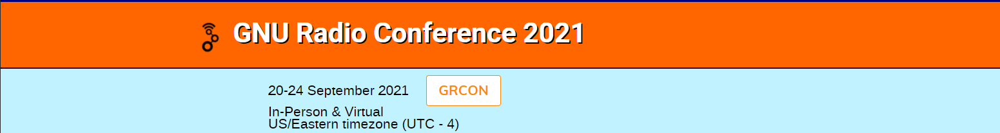

## Rules 

[GRUCon Home](https://events.gnuradio.org/event/8/)

[CTS CTF Home page](https://cts.gnuradio.org/)

[Scoreboard](img/scoreboard.png)

Top teams ( my team is **Radio Coders** %)

* [Place 1](img/place1_team.png)
* [Place 2](img/place2_team.png)
* [Place 3](img/place3_team.png)

My writeups:

## Write-ups

[Tasks graph](img/tasks.png)
## Level 1
 - [Task 1](task1/sol.md)
 - [Task 2](task2/sol.md)
## Level 2
 - [Task 3](task3/sol.md)
## Level 3
 - [Task 4](task4/sol.md)
 - [Task 5](task5/sol.md)
## Level 4
 - [Task 6](task6/sol.md)
 - [Task 7](task7/sol.md)
## Level 5
 - [Task 8](task8/sol.md)
## Level 6
 - [Task 9](task9/sol.md)

## Surprise level
 - [Surprise Signal 1](surprise/sol.md)

## Ssh! level
 - [Whisper 1](ssh1/sol.md)
 - [Whisper 2](ssh2/sol.md)
 - [Whisper 3](ssh3/sol.md)
 - [Whisper 4](ssh4/sol.md)