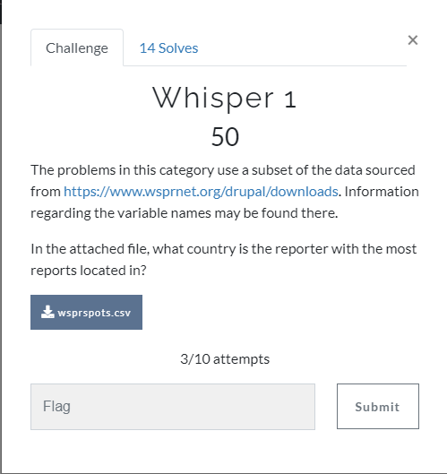

# Whisper 1



## Input files:

* [wsprspots.csv](input/wsprspots.csv )

## Solution:

Input file containes data in [CSV](https://en.wikipedia.org/wiki/Comma-separated_values) format:

```
Reporter,Distance,Call Sign,Reporter's Grid,Grid
KA7OEI-1,2955,1Z2CPJ,DN31uo,FN25dj
DB9OH,816,2E0SXX,JO52ji,IO91
DC1RDB,945,2E0SXX,JN58ss,IO91
DJ4FF,886,2E0SXX,JN47vq,IO91
...
```
PS: first line is column's names!

To find country with the most reports reporter I wrote simple Python [script](script/task1.php):

```Python
#!/usr/bin/env python3

import os, sys
from collections import Counter
from pyhamtools import LookupLib, Callinfo

res_reporter = Counter()

res_maxdst = 0
res_reporter_most = None
res_most_distant = None

with open("../input/wsprspots.csv","rt") as f:
    lines=f.readlines()
    for l in lines[1:]:
        l=l.strip()
        reporter, sdistance, callsign, reporter_grid, grid = l.split(',')
        distance = int(sdistance)
        res_reporter[reporter] +=1
    res_reporter_most = res_reporter.most_common(1)[0][0]

    my_lookuplib = LookupLib(lookuptype="countryfile")
    cic = Callinfo(my_lookuplib)
    try:
        print("Reporter with the most reports located in: {}, {}".format(res_reporter_most, cic.get_country_name(res_reporter_most)))
    except:
        pass
```

To get country name from call sign's I used [pyhamtools](https://github.com/dh1tw/pyhamtools) module.