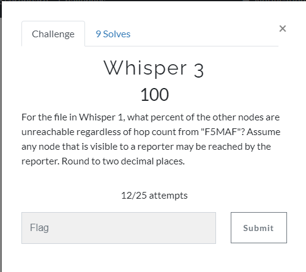

# Whisper 3




## Input files:

* [wsprspots.csv](input/wsprspots.csv )

## Solution:

Input file containes data in [CSV](https://en.wikipedia.org/wiki/Comma-separated_values) format:

```
Reporter,Distance,Call Sign,Reporter's Grid,Grid
KA7OEI-1,2955,1Z2CPJ,DN31uo,FN25dj
DB9OH,816,2E0SXX,JO52ji,IO91
DC1RDB,945,2E0SXX,JN58ss,IO91
DJ4FF,886,2E0SXX,JN47vq,IO91
...
```
PS: first line is column's names!

Just simple python coding %) - I have such expirience from competitive programming CTFs.
Some notes:
* I used BFS for nodes conenctivity checking
* BFS run only once due - during this run we calculate minimal distance to every reachable node. If node is not reachable distance is left 0 and correspindent value in V is False.
* at the end of BFS method I just count number of not-visited and divide on the number of all nodes except myself. Due to first I forgot to not count myself %) - I spent a lot of false tries %))) 
* before BFS I converted all nodes names (i.e. call signs) to numbers. It will simplifies arrays usage + increase total perfomance.

```python
#!/usr/bin/env python3

import os, sys
from collections import Counter
from types import DynamicClassAttribute
from collections import *
from itertools import *
#from pyhamtools import LookupLib, Callinfo


# For the file in Whisper 1, what percent of the other nodes are unreachable 
# regardless of hop count from "F5MAF"? 
# Assume any node that is visible to a reporter may be reached by the reporter. Round to two decimal places.

node2check = "F5MAF"

# vertices have nums 0..N-1
class Graph(object):
    def __init__(self,n):
        self.VN=n
        self.G = [[] for _ in range(n)]
        # BFS
        self.V  = None # visited
        self.D  = None # min distance
        self.PR = None # parent


    def add_edge(self,x,y):
        self.G[x].append(y)
        #not directed:
        self.G[y].append(x)

    def BFS(self,root=0):
        N =self.VN
        P  = self.PR  = [None]*N
        D  = self.D   = [0]*N
        V  = self.V = [False]*N 

        G  = self.G 
        i=0
        # start from root node
        v=root
        D[root]=0
        q=deque([root])
        while q:
            v=q.popleft()
            pv=P[v]
            dv=D[v]
            V[v] = True
            for w in G[v]:
                if V[w]: 
                    continue #already visited
                P[w]=v
                D[w]=dv+1
                q.append(w)
        # count unreachable
        notvisited = len(V)-sum(V)
        return notvisited/(len(V)-1) # -1 to exclude root from result

# vertices have nums 0..N-1
map_cs2num = dict()
map_num2cs = []
edges = set() 

# maps callsigns to numeric node ids
# nodes numbered 0..N-1 where N is a numberof distinct call signs
def get_cs_idx(cs):
    # try get numeric id of node
    n_cs =  map_cs2num.get(cs, None)
    if n_cs!=None:
        return n_cs #if found - return it
    #assign id to new node
    n_cs = len(map_cs2num)
    map_num2cs.append(cs)
    map_cs2num[cs]=n_cs
    return n_cs

# parse input file 
with open("../input/wsprspots.csv","rt") as f:
    lines=f.readlines()
    for l in lines[1:]:
        l=l.strip()
        reporter, sdistance, callsign, reporter_grid, grid = l.split(',')
        n_rep = get_cs_idx(reporter)
        n_cs  = get_cs_idx(callsign)
        edges.add( (n_rep, n_cs) )
        if reporter == node2check:
            print(n_rep, n_cs)

# get a number of distinct nodes
nodes_cnt = len(map_num2cs)

# create graph
graph = Graph(nodes_cnt)
for u,v in edges:
    graph.add_edge(v, u)

# get id of node to check
n_src = get_cs_idx(node2check)

# run BFS and print result
print("{:.2f}".format(graph.BFS(n_src)*100))
```