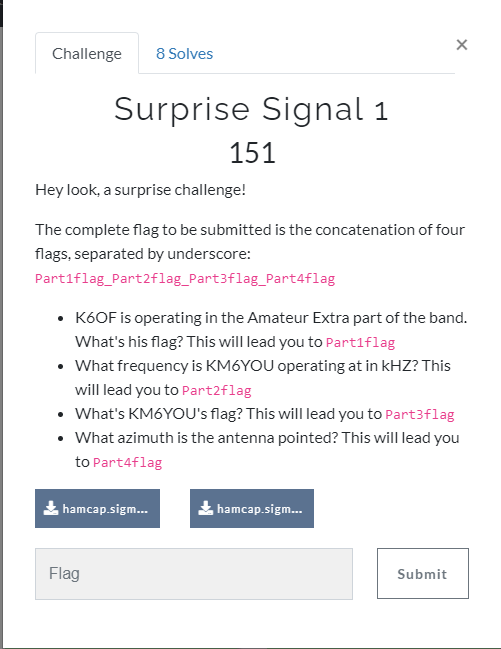

# Surprise Signal 1

## Input files:

* [hamcap.sigmf-data](input/hamcap.sigmf-data)
* [hamcap.sigmf-meta](input/hamcap.sigmf-meta)

## Solution:

If check meta file we will see that data coded "ci16_le" i.e. complex (signed) integer little endian

Due to in most cases better have the cf32/complex32 (i.e. complex float) enocded one I wrote simple Python [script](scripts/convert.py) basing on read/write [SigMF examples](https://github.com/gnuradio/SigMF).

As result I got cf32 **hamcap.raw** file which used later in GQRX

### Part 1: *K6OF is operating in the Amateur Extra part of the band. What's his flag? This will lead you to Part1flag*

### Part 2: *What frequency is KM6YOU operating at in kHZ? This will lead you to Part2flag*

### Part 3: *What\'s KM6YOU\'s flag? This will lead you to Part3flag*

### part 4: *What azimuth is the antenna pointed? This will lead you to Part4flag*

It is the simplest - just check the meta file ( 97.1 )

