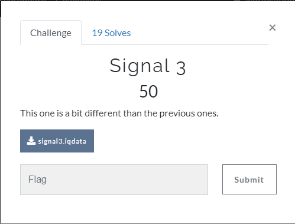

# Task 3

## Input file:

[signal3.data](input/signal3.data)

## Solution:

The same as in 
[HWIO2021 CTS, Task 3](https://github.com/BlackVS/CTFs/blob/master/HWIO2021/CTS/task3.md):

[Script](scripts/task3.py)

