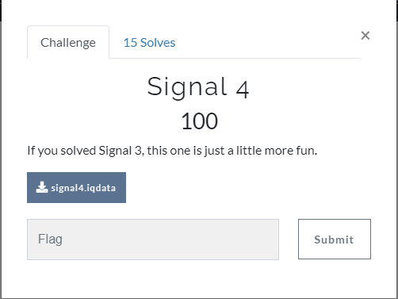
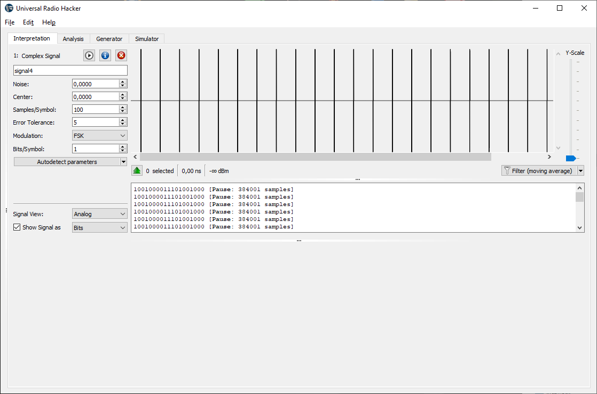
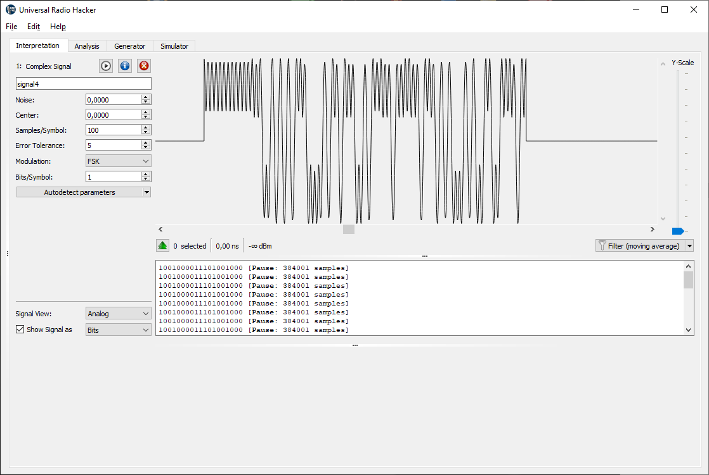
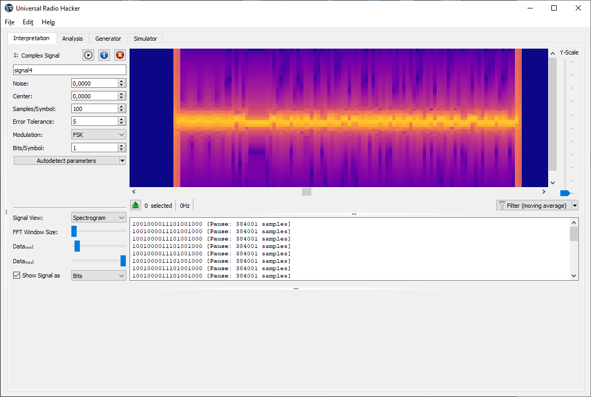
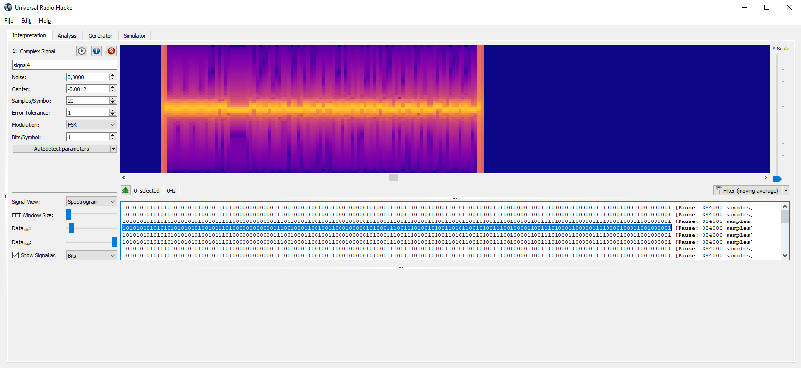

# Task 4

## Input file:

[signal4.data](input/signal4.data)

## Solution:

1. Open in URH:

2. Check waveform:

3. Check spectrum. Looks like only 2 near frequencies i.e. 2FSK:

4. Select modulation FSK and bit/symbol=1 and click autodetect:

...and get decoded bitstream:

6. To decode bistream use we same [script](scripts/task4.py) as in task3.

