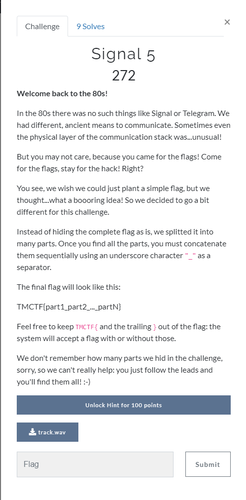

# Task 1

## Input file:

[track.wav](input/track.wav)

## Solution:

The task same as in  

[HWIO2021 CTS, Task 5](https://github.com/BlackVS/CTFs/blob/master/HWIO2021/CTS/task5.md)

but write-up from link above contains few erros - not accuratly decoded DTMF (one wrong symbol) and one mistake in decoded part3 %)) Just do more accuartly.

