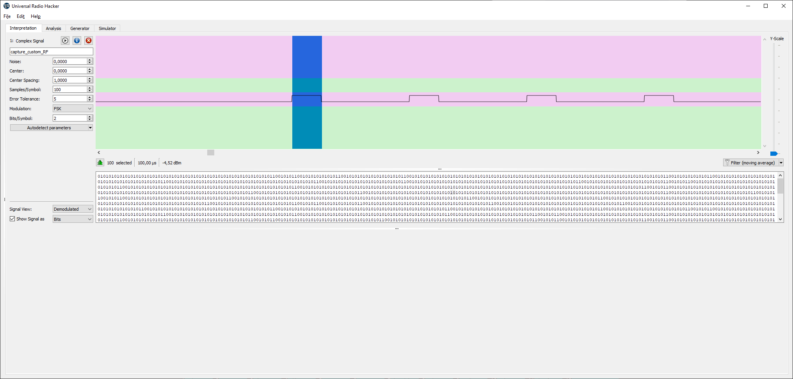
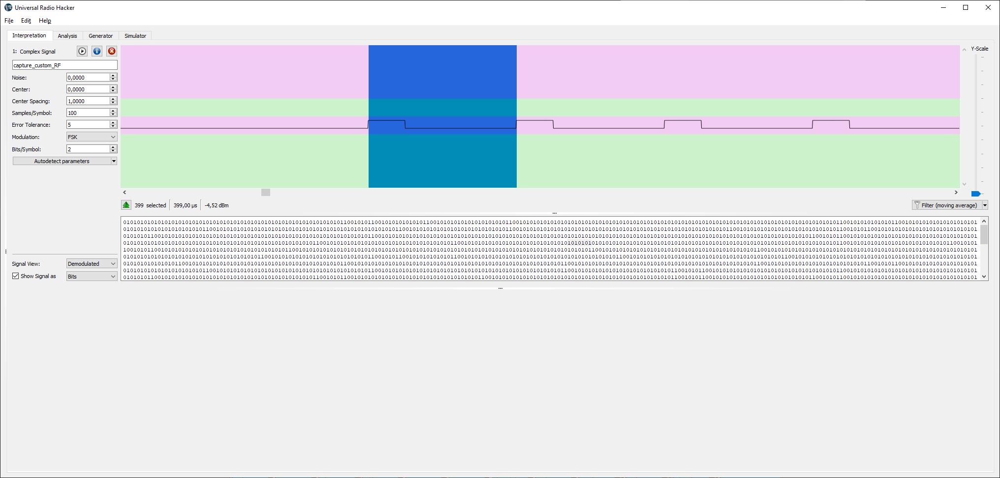

# Task 6

## Input file:

[capture_custom_RF.cfile](input/capture_custom_RF.cfile)

## Solution:

1. Open in URH, amplitude is constant:

2. Frequencies - we have hopping between 3 distinct frequencies i.e. 3FSK

3. Make FFT window minimal as possible - we see that at any moment only one of frequencies is used:

4. Measure pulse ...:

...and pause width:

5. I decided convert signal to 012 sequence basing on the next considerations:
- each symbol is 400 samples length
- at the beginning of such 400 samples block we have "strobe" 100 samples width which defines the symbol - 0, 1, 2
- due to URH uses only power two FSK size i.e.2FSK, 4FSK etc I decided decode as 4FSK with "11" unused i.e. 00->0, 01->1, 10->2
- I set symbol width equal to 100 not 400. In such case 0->00000000, 1->01000000, 2->10000000

Demodulated bistream was saved to [bits.txt](scripts/bits.txt)

6. To convert bitstream from p.5 I wrote simple python [script](scripts/task6.py)

As result I got base 3 sequence [string](scripts/out.txt).

This string is 1 to 1 equal to source signal.

But what next?

Just some CyberChef [magic](https://gchq.github.io/CyberChef/#recipe=Fork('%5C%5Cn','%5C%5Cn',false)From_Base(3)From_Decimal('Line%20feed',false)Merge()Remove_whitespace(true,true,true,true,true,false)&input=MDEwMDEwCjAwMjIxMgowMDIxMTEKMDEwMDEwCjAwMjEyMQowMTExMjAKMDEwMDEyCjAwMTIxMAowMTExMDIKMDAxMjIwCjAxMDIwMQowMTAxMTIKMDEwMDAwCjAxMTEwMAowMDEyMjEKMDExMDAwCjAwMTAyMAowMTAyMTAKMDExMTExCjAxMDExMgowMTAyMjIKMDAxMDIwCjAxMTAwMAowMDEyMTAKMDEwMjExCjAxMDAwMQowMTAxMjEKMDAyMjEyCjAxMDExMgowMTEwMDIKMDExMTAwCjAwMjAwMQowMDIwMDEKMDAxMDIwCjAxMTAwMgowMDEyMjAKMDExMDIxCjAxMTAyMQowMTAxMTIKMDAxMjIwCjAxMDIxMAowMTAyMTAKMDAxMjIwCjAxMDIwMAowMTEwMjIKMDEwMjIwCjAxMTEwMQowMDEyMjAKMDEwMTEyCjAxMDIwMAowMDIyMjEKMDExMDAyCjAxMTAyMgowMTAyMDIKMDExMDAxCjAxMTAxMQowMDIwMDEKMDEwMTEyCjAxMDIxMgowMDEyMjEKMDExMDAyCjAxMDIwMQowMTAyMDAKMDExMTAwCjAxMDIxMAowMTAyMTAKMDEwMTEyCjAxMTAxMQowMTEwMDAKMDAxMjIxCjAxMTAyMgowMTExMTEKMDExMDExCjAxMTEwMAowMTAwMDIKMDEwMTEyCjAxMTAyMAowMDEyMjAKMDEwMjEwCjAxMTEwMAowMTEwMjIKMDEwMTIxCjAxMDEyMgowMTEwMDAKMDEwMjAyCjAxMDExMgowMTAyMDEKMDAyMTIwCjAxMTAxMQowMTExMDAKMDExMDIyCjAxMDIyMAowMTExMTIKMDEwMjAyCjAxMDExMgowMDIyMjIKMDExMDIwCjAwMTIyMAowMTEwMjIKMDExMTEyCjAwMTIyMAowMTEwMDAKMDEwMTEyCjAxMTAyMAowMDEyMjAKMDExMDIyCjAxMDIxMgowMDEwMjAKMDExMDAyCjAxMDIyMgowMTExMjI) %)
