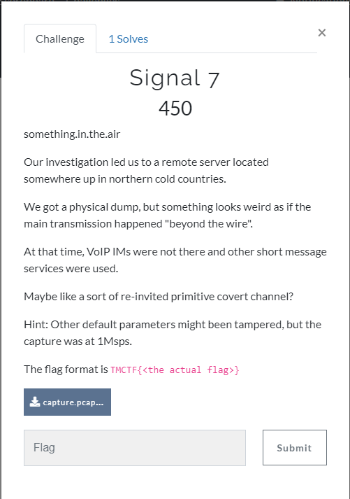
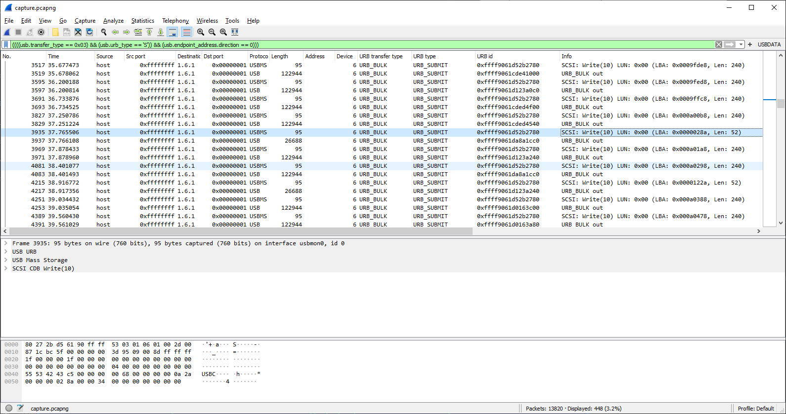
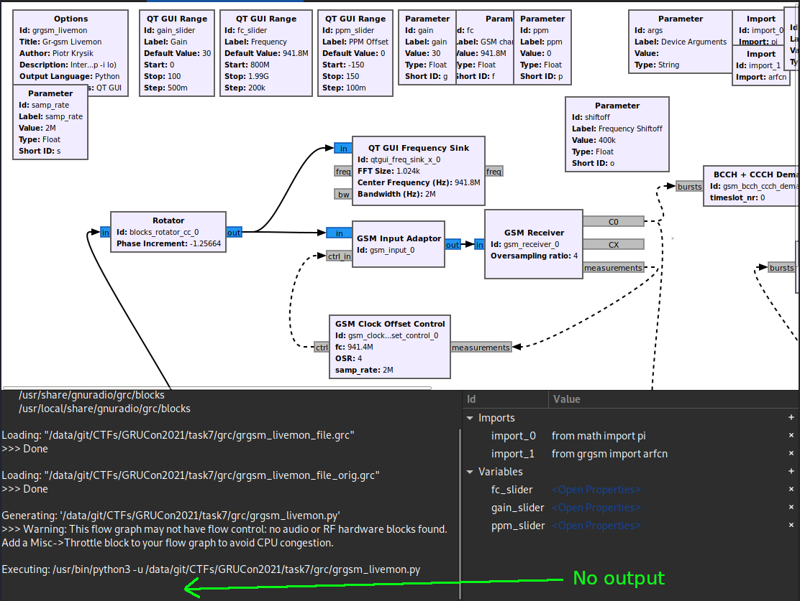

# Task 7



## Input file:

[capture.pcapng](input/capture.pcapng)

## Solution:

The task the same same as in 
[HWIO2021 CTS, Task 7](https://github.com/BlackVS/CTFs/blob/master/HWIO2021/CTS/task7.md)

I was right in general solution approach and some assumptions made at the end of mentioned write-up but


## 1. USB data parsing

Just to extract using:
```bash
"C:\Program Files\Wireshark\tshark.exe" -r data.pcapng -T fields -e usb.capdata -Y usb.capdata > capdata.raw
```
was not correct way.

If look more carefully to packets flow we will see that each write operation consist of 2 steps:


- send address to be written to (LBA - Logical Bloak Address)
- send data

Filter only this packets and check them



We see that packets not written sequentially - sometimes other blocka written and it is normal due to it is USB drive which is random access device.

To extract data more accuratly we need check LBA addresses and sort written data in LBA order.

I.e. to extract raw USB data I did:

1. Filter specific packets (image above)
2. Exported them to the old fromat .pcap (I didn't exported to .pcapng due to need only raw packets processing in my Python script
3. Extracted ordered raw data using my Python [script](sricpts/parse.py):
```python
#!/usr/bin/python
import binascii
import dpkt
import struct
import sys

# Start the pcap file parsing
f = open("usbtraffic.pcap", 'rb')
pcap = dpkt.pcap.Reader(f)
#print(pcap)
lba = 0
packets = []
for ts, buf in pcap:
    #print(ts)
    if buf[64:68] == b'USBC':
        #lba = int( buf[], 16)
        a = buf[0x51:0x55]
        lba = int.from_bytes(a, 'big')
        b = buf[0x56:0x58]
        blen = int.from_bytes(b, 'big')
        print(hex(lba))
    else:
        packets.append(  (lba, blen, ts, buf[64:] ) )

packets.sort()
with open("usbtraffic.raw","wb+") as f:
    for lba, blen, ts, b in packets:
        print("Writing lba={} len={} ts={}".format(lba, blen, ts))
        f.write(b)
```

Offsets like "0x51:0x55" I got inspecting packets in Wireshark

4. Now we have **usbtraffic.raw** file which I analyzed using binwalk with -e option.
Surprise - extracted data much larger comparing to the extrected in my write-p from HWIO2021 %)


## 2. Demodulating

Basing on [gr-gsm](https://github.com/ptrkrysik/gr-gsm))

My suggestion in [HWIO2021 CTS, Task 7](https://github.com/BlackVS/CTFs/blob/master/HWIO2021/CTS/task7.md) was correct - it is GSM signal.

But why grgsm_decode decoded nothing?

Reson is quite ... silly? Thanks to Don (flamewires team) who pushed me in right direction.

Opening signal using gr-gsm livemon graph ( https://github.com/ptrkrysik/gr-gsm/tree/master/apps, sure replacing input block to File Source - like [here](rgc/grgsm_livemon_file_orig.grc) ) we will see:


and now decoded data seen:



If check original [livemon graph](https://github.com/ptrkrysik/gr-gsm/blob/master/apps/grgsm_livemon.grc) more carefully we will see Rotator block which shifts spectre left:
```
-2*pi*shiftoff/samp_rate
```
Just removing this block (or making it zero) not helps


but making it opposite sign i.e.:

```
+2*pi*shiftoff/samp_rate
```
(or the same as make shiftoff=+400e3):


looks like give us some signal in the middle and


we see decoded data!!!!

Next what I did - wrote shifted signal to file (adding File Sink in file):

[2file](grc/grgsm_livemon_2file.grc)

Saved file named *telesignal_1msps_rotated.complex32* and later worked with it.

## 3. Decode

Next I did basing on [GSM:Sniffing SMS traffic](https://www.ckn.io/blog/2015/11/29/
gsm-sniffing-sms-traffic/)


Run Wireshak to listen local loppback and filter only gsmtap:

```bash
sudo wireshark -k -Y gsmtap -i lo
```


Next decode BCCH:

```bash
grgsm_decode -a 34 -c telesignal_1msps_rotated.complex32 -t 0 -m BCCH
```

We will decoded packets (like we saw in GNU Radio before but here they are parsed):


... and I stuck here %) during CTF.

Thanks to ElyKar for sharing it's writeup:

Normally, Wireshark should display GSM packets now. We can see some have been correctly decoded, like "System Information" or "Paging Request".

There is one packet of type "Immediate Assignment", which indicates an equipment is connecting to the network.


In this packet, we need the channel description :

- Timeslot (it is 0)
- SDCCH4


Now, we can decode the control channel of the connection : 
```
grgsm_decode -a 34 -c telesignal_1msps_rotated.complex32 -t 0 -m BCCH_SDCCH4 -v -p
```

We see new packets in Wireshark. In particular, the "Paging Response" indicates that there is no encryption key available, meaning that the data sent won't be encrypted.


Finally, we can see a decoded SMS packet which was not encrypted. We can read the content of the SMS:


