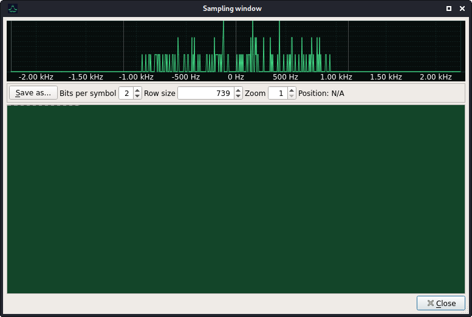

# Task 8

## Input file:

[signal8.iqdata](input/signal8.iqdata)

## Solution:

As base I used Drake's Signal 5 [write-up](https://batchdrake.github.io/ctsII/).

First I tried solve it using URH:

and try decode demodulated bitstream (4FSK) but failed.

Finally I switched to SigDigger due to it allow more accurate timespace operations:

Demodulated data were decoded using [C++ programm](script/check1.cpp).

