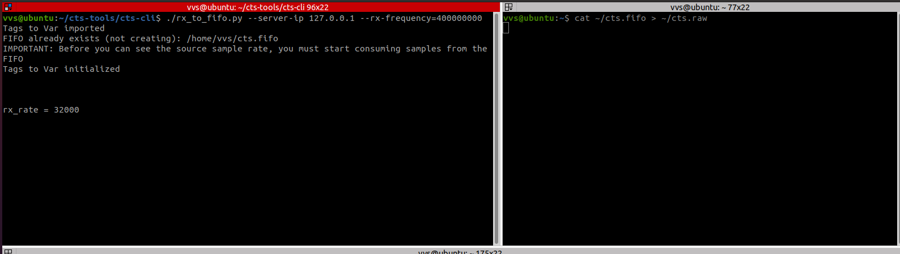
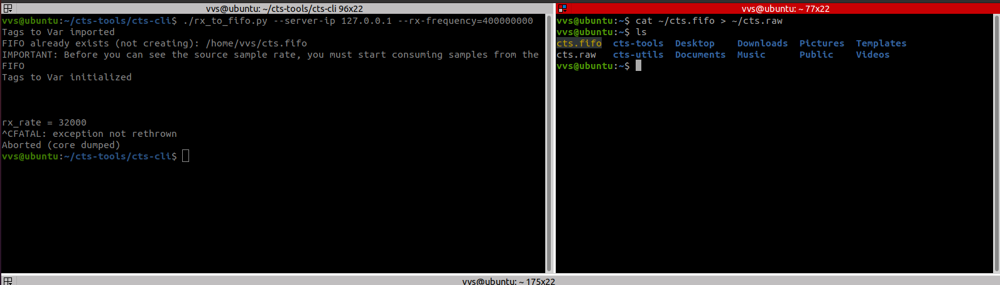
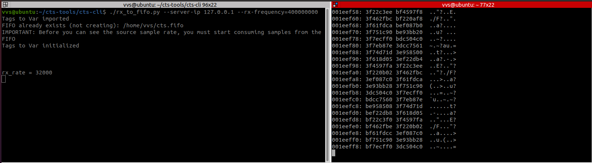
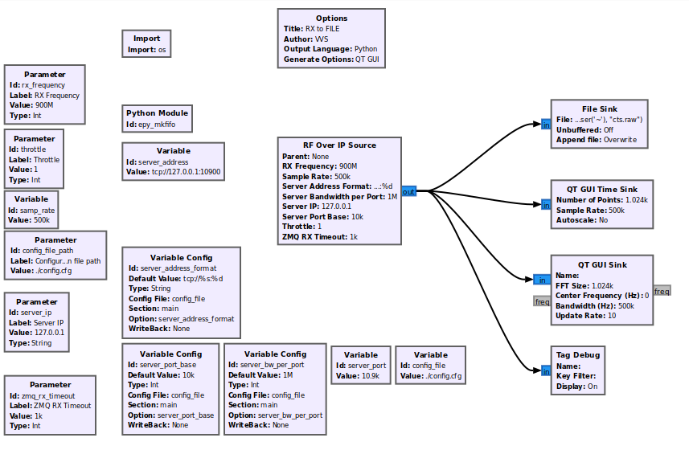
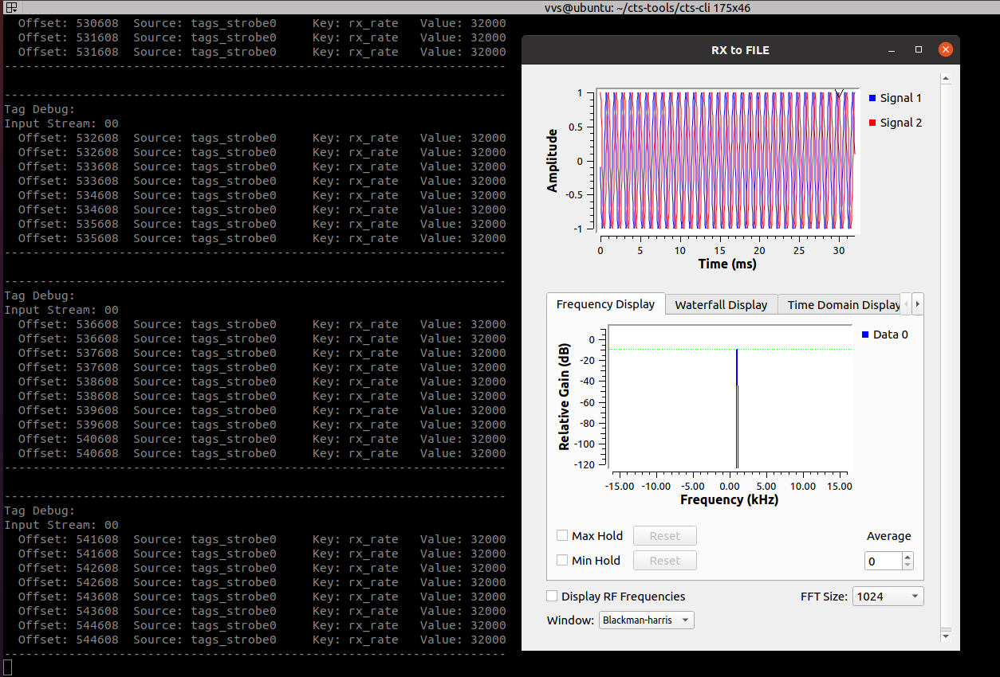

# Receiving and recording signals

## Official way

As decsribed in [official docs](https://github.com/capturethesignal/cts-tools) to startreceiving your should do 2 things:

A) start piping data from input fifo to desired file (or somewhere else).
B) Run network streamer rx_to_fifo.py.

You have run these two command in difefrent terminal windows.

For example, if we have local signal source at 400Mhz:

terminal A

```bash
cat ~/cts.fifo > ~/cts.raw
```

terminal B
```bash
./rx_to_fifo.py --server-ip 127.0.0.1 --rx-frequency=400000000
```

and you will see:



To stop recording push Ctrl-C:



As result cts.raw file will be created in home directory with written signal.

Also you will see symbol rate (here is one trick - symbol rate sent by server as tag value *rx_rate*)

If you just want to see if server alaive run
```
cat ~/cts.fifo | xxd -g 4 -c 8 -e
```
as A command:




## VVS way %)

Due to I'm to lazy I modified rx_to_fifo and named it [rx_to_file](https://github.com/BlackVS/cts-tools.git). 
Sure it is Python 3 only but you can do the same for Python 2 cts tools easily too:



Differences - it writes directly to file (file is overwritten at start, official rx_to_fifo ), also GUI shown to chacke signal on-the-fly + printing tagged values if are in stream.

Usage the same as for rx_to_fifo but with no need to copy anything from cts.fifo (cts.fifo not crteated!).

I.e. just one command:

```bash
./rx_to_file.py --server-ip 127.0.0.1 --rx-frequency=400000000
```




