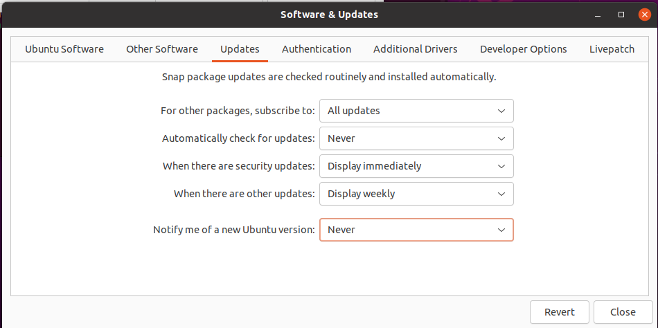
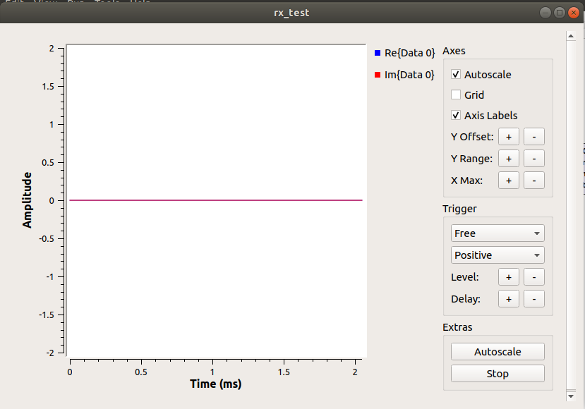

# Tools

As written in official CTF info you need [CTS tools](https://github.com/capturethesignal/cts-tools) installed and tested prior CTF starts.

Here is one important note - cts tools build for GNU Radio 3.7 which Python 2 only.

But starting January 1st 2020 Python reached EoL and all as result GNU Radio 3.7 is the latest Python 2 built version, GNU Radio 3.8+ are Python 3 based.

Here are few options (really tehre are a lot of options but below are simplest ones):


## A. Install Ubuntu 18.04, GNU Radio 3.7, official cts-tools. 

Why Ubuntu 18.04? It is one of latest Ubuntu builds which have Python 2 as main + GNU Radio 3.7 can be easily installed from Ubuntu repositories.

To help in this way a Ubuntu 18.04 VMs with installed GNU radio can be downloaded from [downloads](https://cts.ninja/downloads/). VM password are given before CTF starts (I'm not sure if I can share it here %).
If you use these VMs then you can skip 1..4 steps

But if don't want wait for password you can just:

1. Install Ubuntu 18.04 ( [downloads](https://releases.ubuntu.com/18.04.5/ ) )

2. disable annoying annatended updates running:
    ```bash
        sudo dpkg-reconfigure unattended-upgrades
    ```
    and choosing "No". Why? Unnatented updates can block you to installing any software manually.

    Also I blocked software updates/upgrades from GUI - very important: Do No Update to later Ubuntu version!!!

    


3. Install GNU Radio:
    ```bash
    sudo apt update
    sudo apt install gnuradio
    ```

4. Install some other needed software:
    ```bash
    sudo apt install git
    sudo apt install make
    sudo apt install xterm
    ```

5. Install cts-tools (I installed them to home dir):
    ```bash
    cd ~
    git clone https://github.com/capturethesignal/cts-tools.git
    cd cts-tools/cts-cli
    make all
    ```
    You should see python files:

    ```
    epy_chdir.py
    epy_mkfifo.py
    epy_tags_to_vars.py
    rf_over_ip_source.py
    rx_test.py
    rx_to_fifo.py
    ```

6. Test - run GNU radio and open rx_test.grc, then execute it. You should see:
    

7. Install some other useful for CTS CTF software (on your choice - I installed all of them %) :
    ```bash
    sudo apt install inspectrum
    sudo apt-get install gqrx-sdr
    sudo apt-get install urh
    sudo snap install urh
    sudo apt install terminator
    ```


## B. Install Ubuntu 21.04, GNU Radio 3.8, non-official cts-tools and cts-utils

If you wish use latest GNU Rdaio or have already installed latest Ubuntu you can follow this way:

1..4 are the same as for Ubuntu 18.04 (sure you have install latest Ubuntu not 18.04 %)

5. Install cts-tools adapted by me to Python 3/GNU 3.8+ (I installed them to home dir):
    ```bash
    cd ~
    git clone https://github.com/BlackVS/cts-tools.git
    cd cts-tools/cts-cli
    make all
    ```
    You should see python files:

    ```
    epy_chdir.py
    epy_mkfifo.py
    epy_tags_to_vars.py
    rf_over_ip_source.py
    rx_to_fifo.py
    rx_to_file.py
    ```
    PS: rx_test.py will not be generated due to flow graph error. I did not manage it yet due to it is the first mye expirience with GNU Radio %) But you can open rx_test.grc from GNU Radio GUI and run/compile to Pyhton from GUI

6. Install cts-utils. It is few simple graphs/scripts to help with writeups:

    ```bash
    cd ~
    git clone https://github.com/BlackVS/cts-utils.git
    ```

