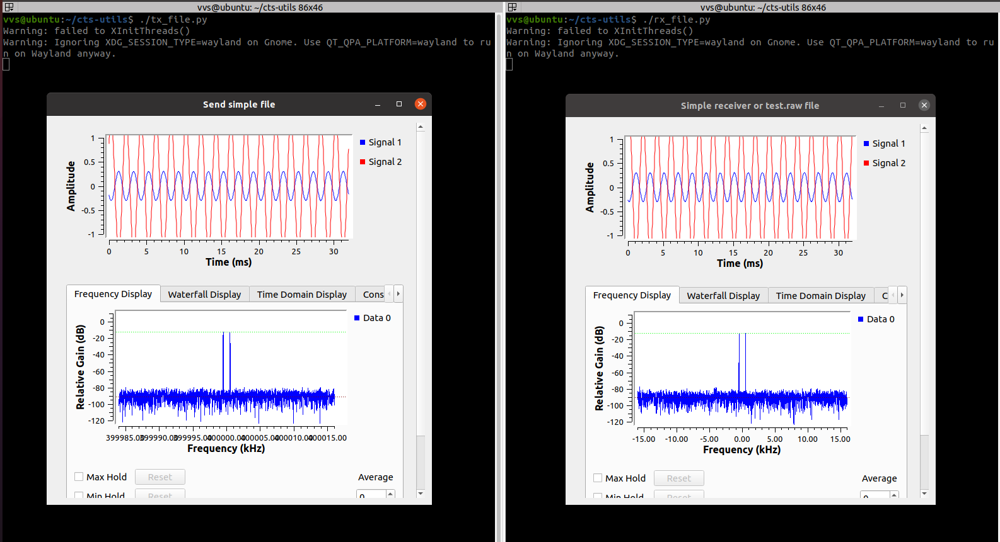

# CTS Utils

To play with CTF signals after CTF ended I created few simple graphs: 

https://github.com/BlackVS/cts-utils/

tx_simple.grc / tx_simple.py - just sends 1kHz 32 ksps at 400MHz on localhost
tx_file.grc / tx_file.py - just sends 1kHz 32 ksps at 400MHz on localhost

rx_simple / rx_file - just receives sent signal

I.e. if run tx_simple.py in one terminal and rx_simple.py in other you should see:

Sure you see the same on both side (i.e. sent and received signals are the same)

For each task I will put corresponding graphs which sends recorded during CTF signals to allow play with them.

Or you can just use recorded signal %)

