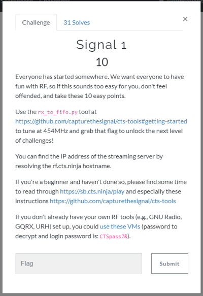
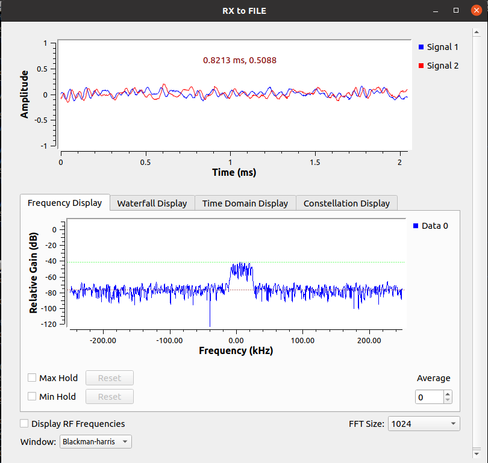
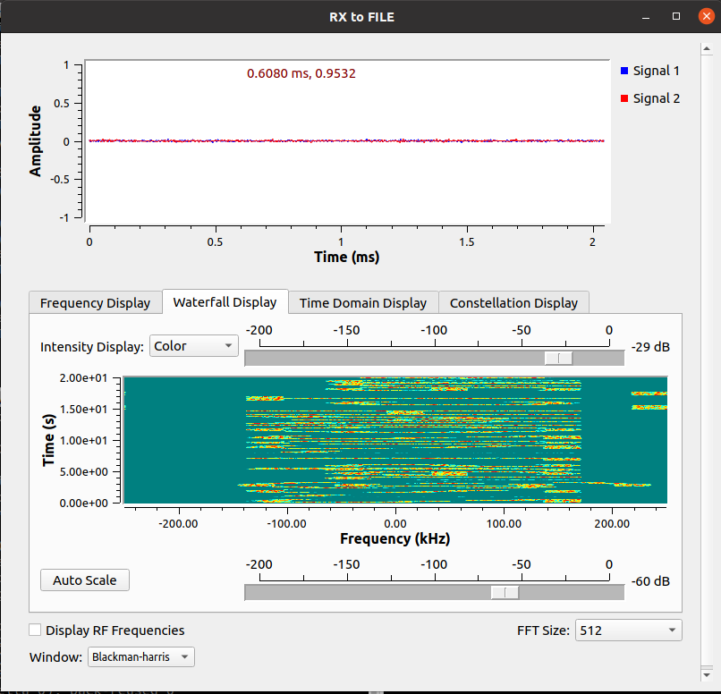
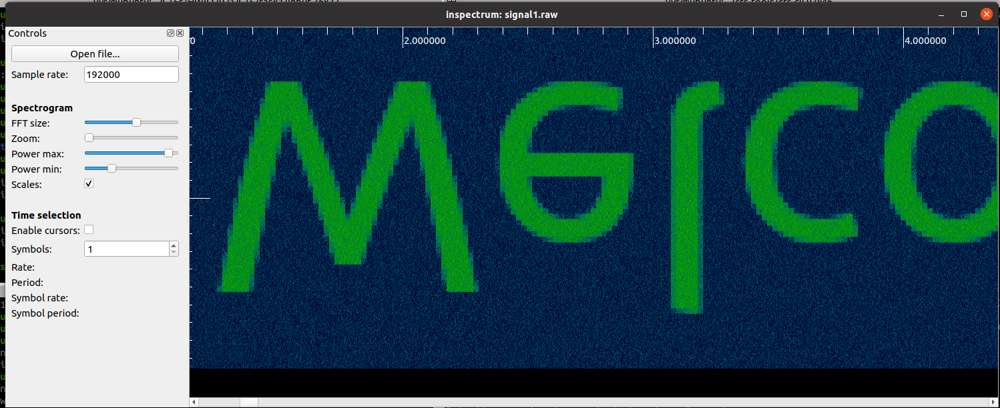
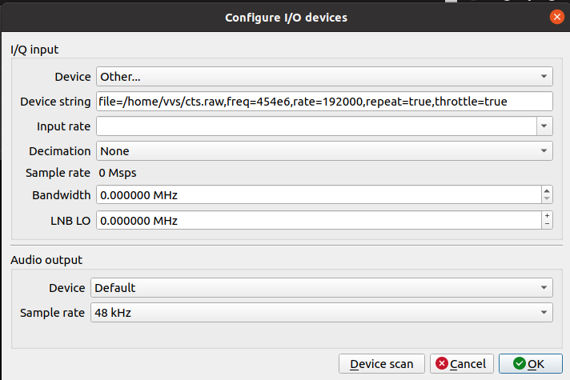
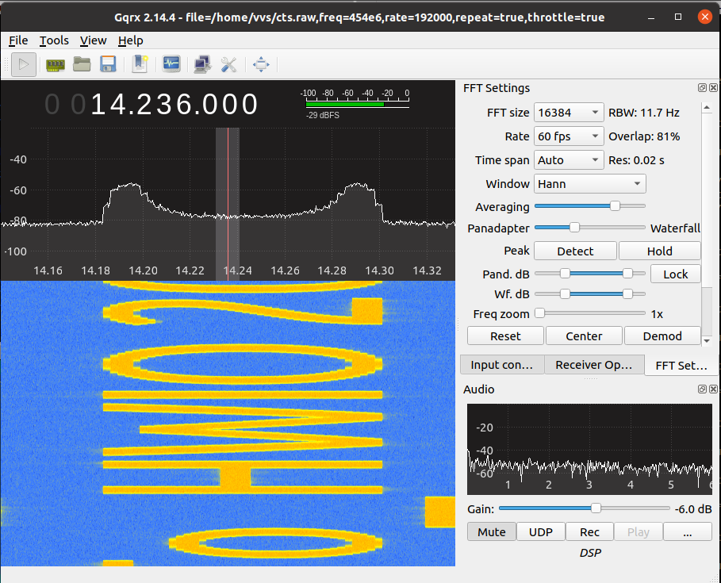
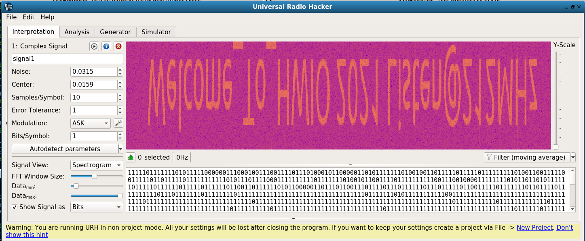

# Task 1



First we have to tune 454MHz and grab the signal (I reading recorded signal from 127.0.0.1, during real CTF use remote IP of server instead 127.0.0.1 ):

```bash
./rx_to_file.py --server-ip 127.0.0.1 --rx-frequency=454000000
```



Switching to waterfall we will something interesting:



Check in inpsectrum:



Check in GQRX:
```
file=/home/vvs/cts.raw,freq=454e6,rate=192000,repeat=true,throttle=true
```





Check in URH:



**Welcome To HWIO2021 Listen@212MHz**

Let's go to 212MHz %)

[Task 2](task2.md)