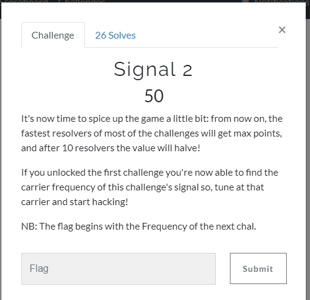
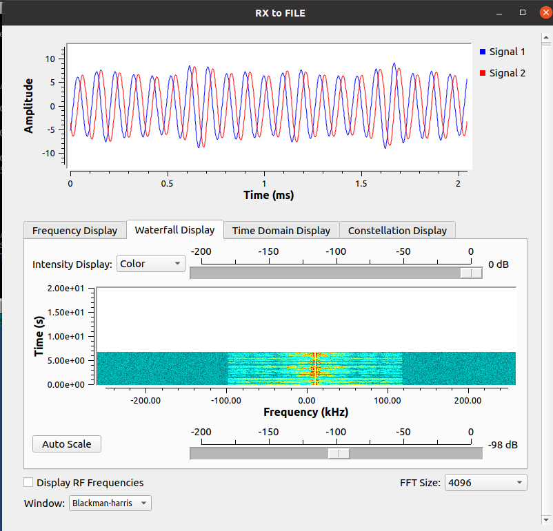
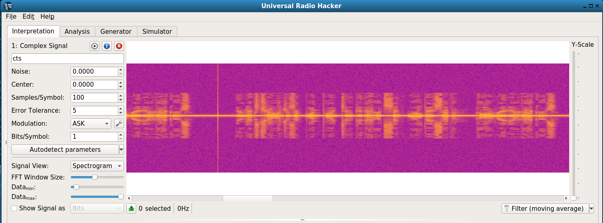
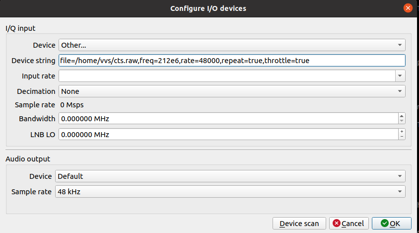
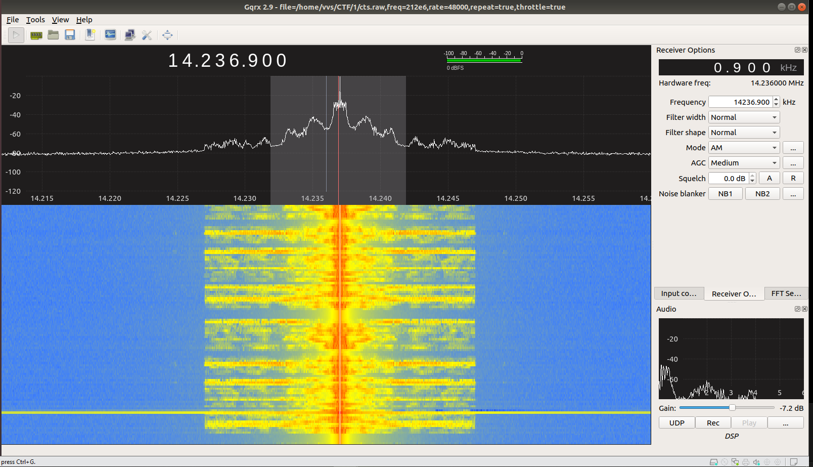

# Task 2



From [Task 1](task1.md) we alredy know that need to listem @212MHz:

```bash
./rx_to_file.py --server-ip 127.0.0.1 --rx-frequency=212000000
```

Symbol rate reported is 48000

Signal looks like AM:



Let's check in URH:



and Gqrx:

```
file=~/cts.raw,freq=212e6,rate=48000,repeat=true,throttle=true
```





and ...
"Hello Radio Hackers Your next challenge is at 1.2GHz Sync Word a7"

PS: for me most difficult was recognize "word" - I heard something like "sync(bla-bla)7" %)) Thanks to David Szili for help %)) Also later CTF team helped people who couldn't recognize speech.

Let's go to 1.2GHz %)

[Task 3](task3.md)

