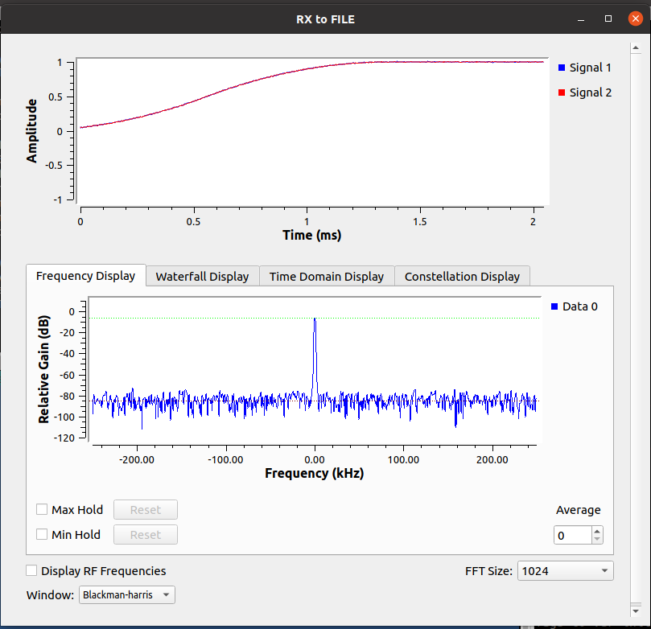
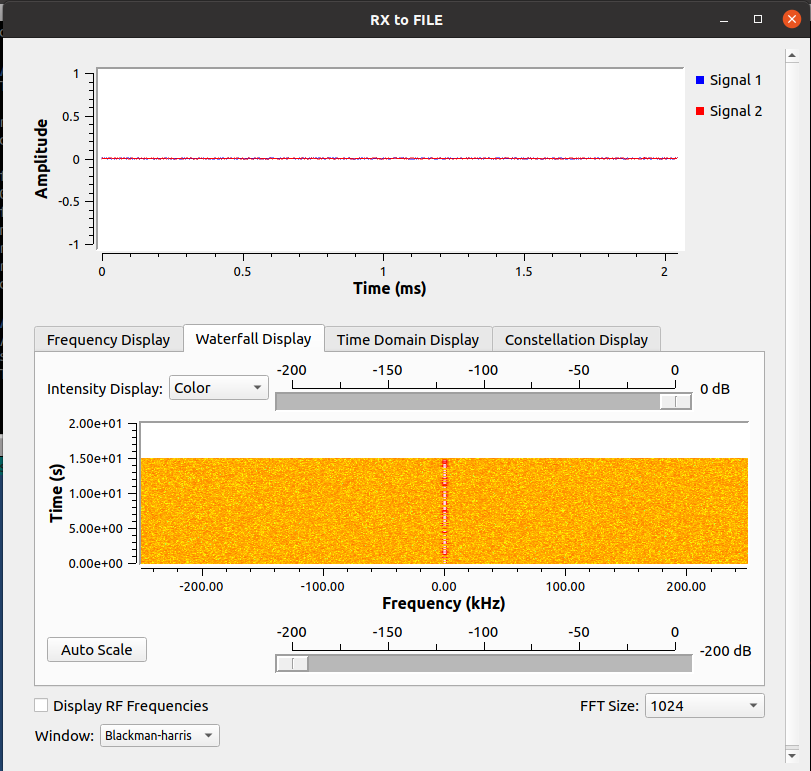
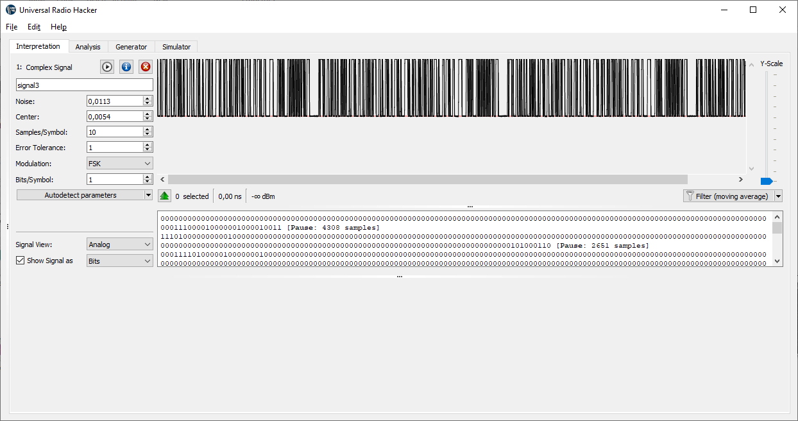
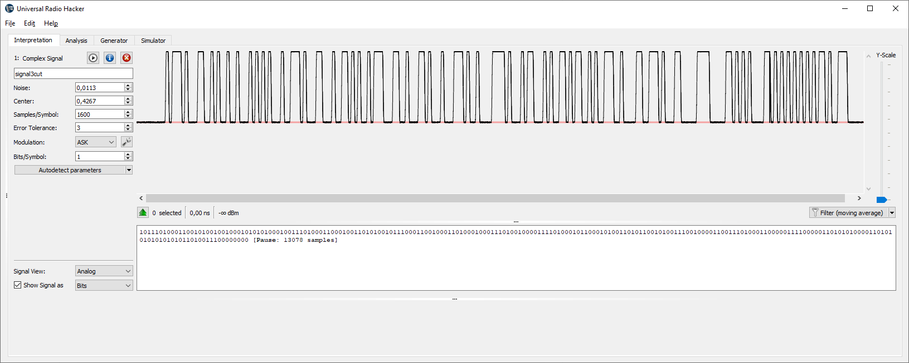

# Task 3


Let's read signal:

```bash
./rx_to_file.py --server-ip 127.0.0.1 --rx-frequency=1200000000
```





Difficult to say.

Will check in URH:



We see repeting of same (looks like) signal.

Let cut and check closer:



Look's like OOK (on-off keying) signal, ASK autodetectiong in URH gives:

```10111010001100101001001000101010100010011101000110001001101010010111000110010001101000100011101001000011110100010110001010011010110010100111001000011001110100011000001111000001101010100001101010101010101011010011100000000```

Similar signal was in https://www.digital.security/en/blog/hardweario-capture-signal-write

Let's try script from there:

```python
#!/usr/bin/env python3

signal = "101110100011001010010010001010101000100111010001100010011010100101110001100100011010001000111010010000111101000101100010100110101100101001110010000110011101000110000011110000011010101000011010101010101010110100111"
for shift in range(8):
    bits=signal[shift:]
    shifted = [ int("".join(map(str,bits[i:i+8])),2) for i in range(0,len(bits),8)]
    temp="".join(map(chr,shifted))
    print(temp.encode())
```

"FREQ:15.24GHz,SYNC:0x5C"

PS: it is brute-forcing approach there we not used info "syncworda7" from previous task

0xA7 = 10100111

but actually data started after "10111" i.e. sync word is 0x17 or just 0x7 ? Or I did mistake (very probably) somethere

In any case go to the 15.24GHz %)

[Task 4](task4.md)


