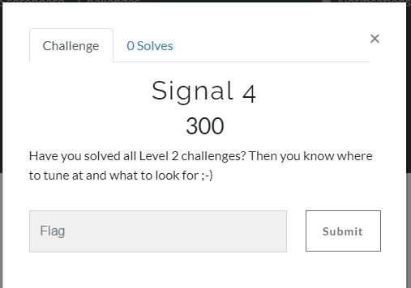
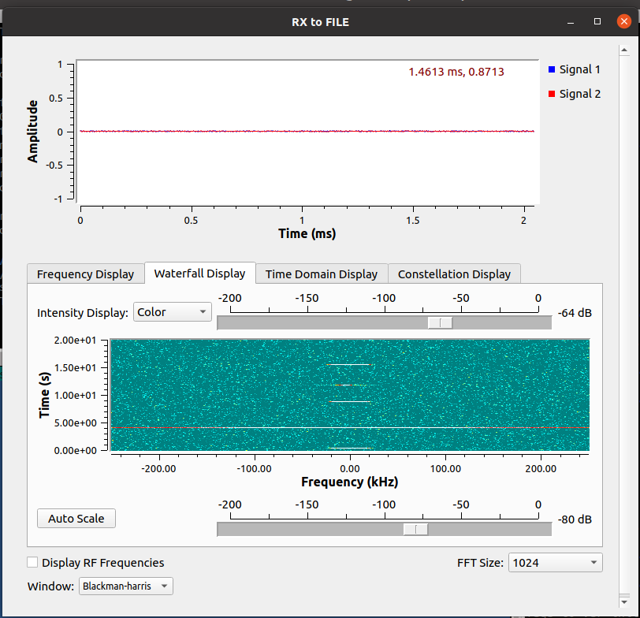
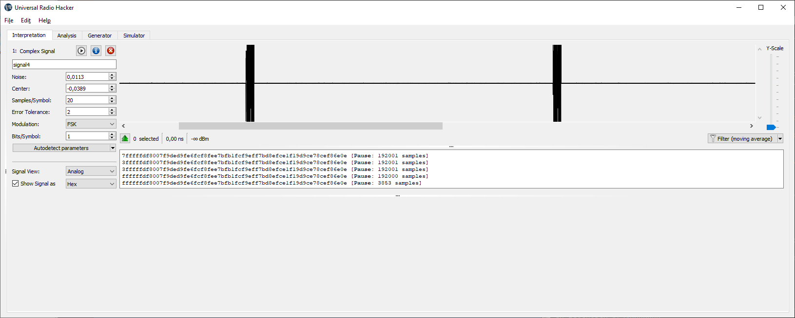
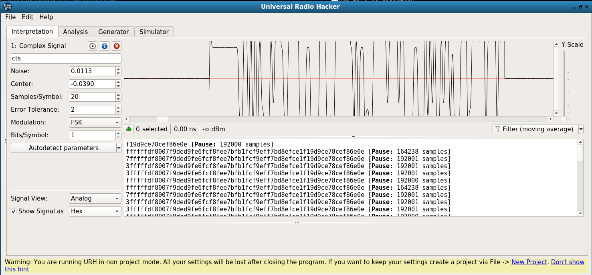
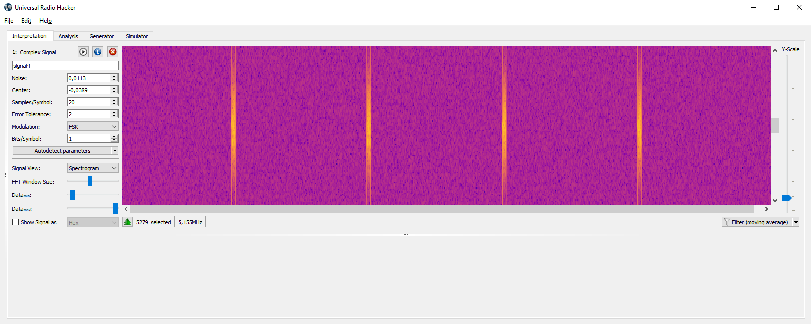

# Task 4

(0 solves)



Check the signal:



Open in URH:







URH auto detect PSK and gives code:

```001111111111111111111111110111111000000000000111111110011101111011011001111111100110111111001111100011111110111001111011111110110001111111001111100111101111111101111011110110001110111111001110000111110001100111011001110011100111100011001110111110000110111000001110```

But I don't see sync word 0x5c = 01011100 (or 10100011) => in it.

Even more - 1's at least 2 in a row, 0's are 1,2,3 ...

I.e. looks like some additional coding but here my knowledge of coding is of %)

PS: spectre gives ideas that it could be something like GFSK or GMSK 
PPS: later from discord - **OQPSK** . Don't know that it means - need learn more, try harder %)

Go to [Task 5](task5.md)


