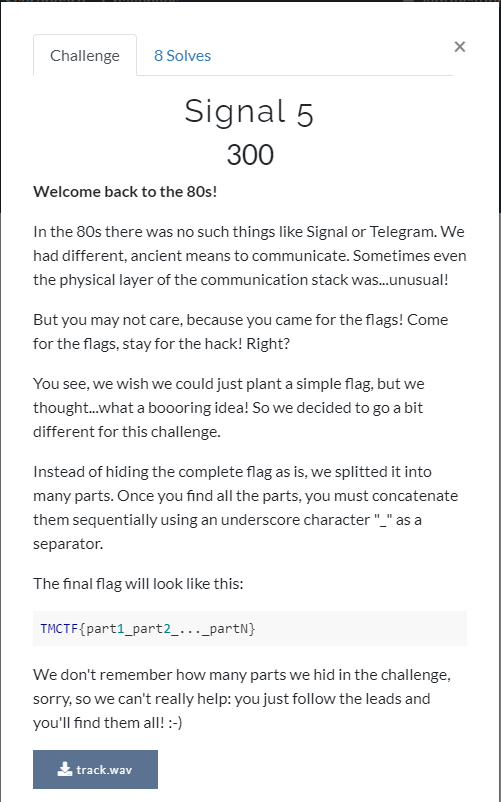
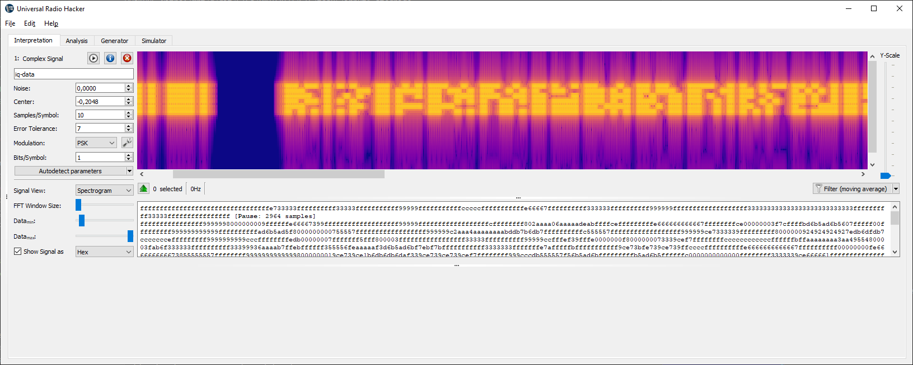
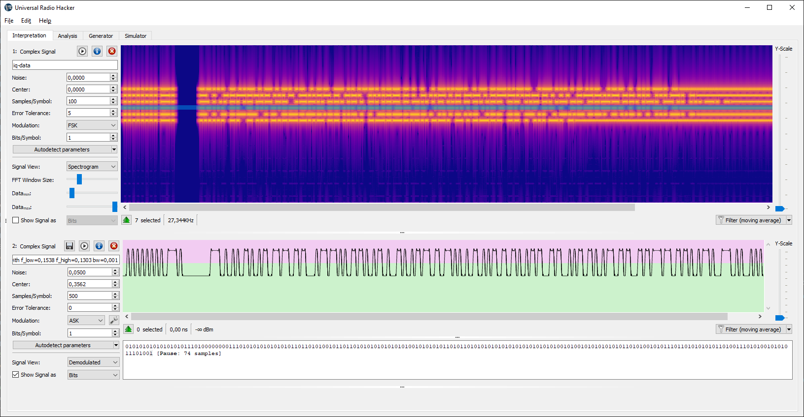
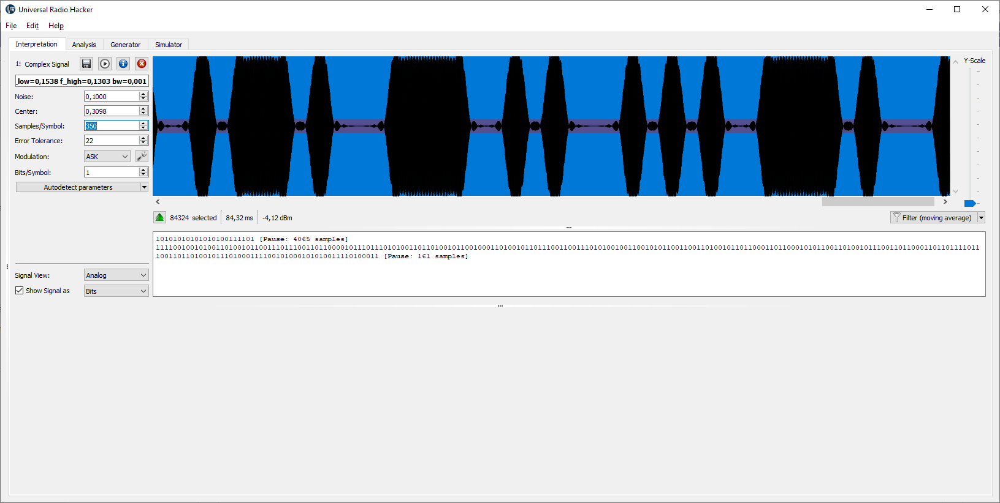

# Task 5



Wav file given.

## Part 1. Morze
Listening it I recognized morze code at the beginning, later DTMF, and later some additional noise.

Decoding Morze (I cut part with Morze code, applied low-band filter and used online Morze decoder ), beginning was recognized good but final part looked broken.
I manually decoded last word and got:

```SOS-STEGHIDE-TOOL-F1N1CKY5HUT```

## Part 2. DTMF

Did the same, tried few also mobile phone, but best result got using http://dialabc.com/sound/detect/index.html

It gives 
```
05208407203506707206507803507008207907703507606907008403508308907806703505065
```

I look close we will saw that it is groups of 3 digits, looks like ASCCII codes:

https://www.dcode.fr/ascii-code

=>


```
DEC /3

4TH#CHAN#FROM#LEFT#SYNC#2A
```

## Part 3. Steg-hide
Hinf from part 1 says that it could steghide coded data with password "F1N1CKY5HUT"

```bash
>steghide --extract -sf track.wav -p F1N1CKY5HUT
wrote extracted data to "iq-data.cfile".
```

Opening in URH and checking spectre gives as clue taht there 6 channels of OOK coded data:



We need "4th from left", it seems to be left is the toward 0 Hz %) i.e. counted from bottom in URH

I opened in URH, see ASK modulation, decoded, tried script from Task 3 and... nothing

At these point I stuck at CTF and switched to other tasks %)

My mistake was that I completely relied on autodetect URH engine.

It fails - URH detected 300 samples/symbol but later (after CTF) I found that correct value 350. I found this value by a lot of different tries, divisions etc %)

I.e. to get part 3:

- open "iq-data.cfile" in URH
- switch spectre view
- select needed band (4th from bottom i.e from left %)
- apply narrow band filter
- choose ASK
- apply noise level 
- autodetect (URH gave me 300 samples/bit)
- set 350 samples
- copy decoded bits to script from Task 3 and






```python
#!/usr/bin/env python3

signal =  "1111001001010011010010110011101110011011000010111011101010011011010010110010001101001011011100110011101010010011001010110011001101001011011000110110001010110011010010111001101100011011011110111001101101001011101000111100101000101010011110100011"

for shift in range(8):
    bits=signal[shift:]
    shifted = [ int("".join(map(str,bits[i:i+8])),2) for i in range(0,len(bits),8)]
    temp="".join(map(chr,shifted))
    print(temp.encode())
```


```
JigsawSidingRefillViscosityEO#
```

I.e. if connect all three parts together flag should be 

TMCTF{SOS-STEGHIDE-TOOL-F1N1CKY5HUT_4TH#CHAN#FROM#LEFT#SYNC#2A_JigsawSidingRefillViscosityEO#}
LATE PS: this flag has 2 mistakes - one mistype in DTMF recodvered code and one char wrong in last part) 
But all process of restoring flag is correct - just do it more carefully than I did %)))
During GRUCon 2021 CTF I did it more carefully + used samples/symbol rate 360 in the last part.

[Task 6](task6.md)


