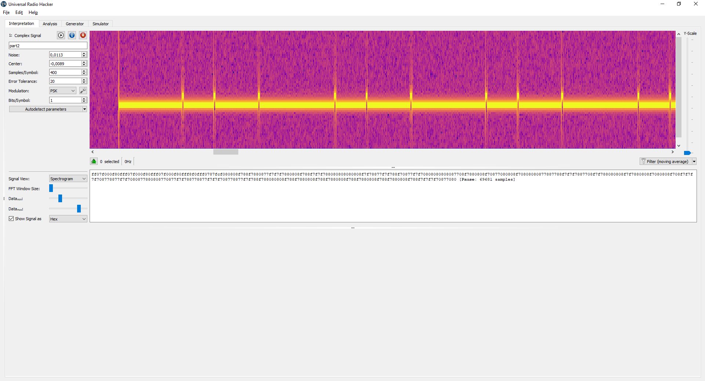

# Task 6

(0 solves)

Read signal:

Signal consists of two parts repeated one by one with big pauses:

I split them and analysed separetly.

Surprise:

At the top the part from signal 6, at the bottom - signal from... task4 %)))

Part 2:

At this point I stopped due to time over.

Current idea is:
* 1's are stop bits between symbols
* each symbol is the number of 0's between two consecutive 1's
* each such symbol corresponds to some char, for exampling adding some constant to get ASCII code

