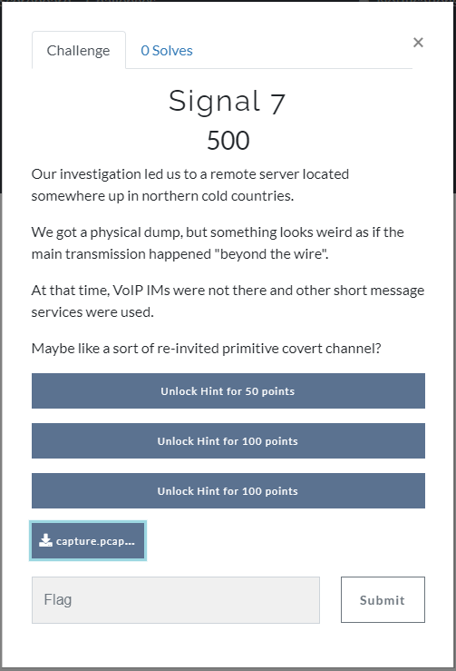
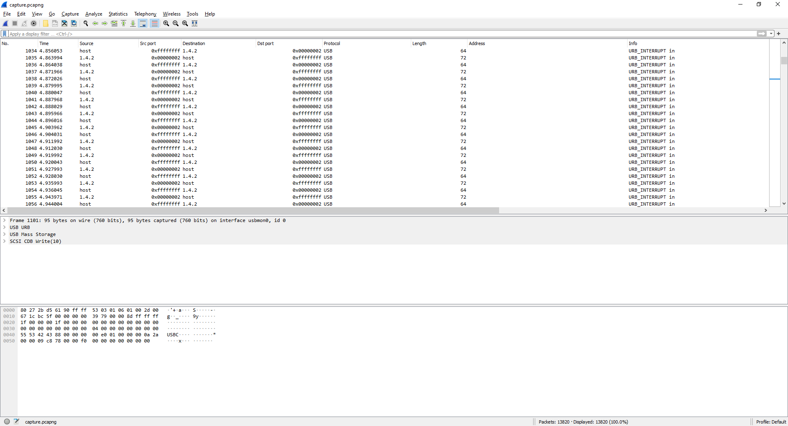
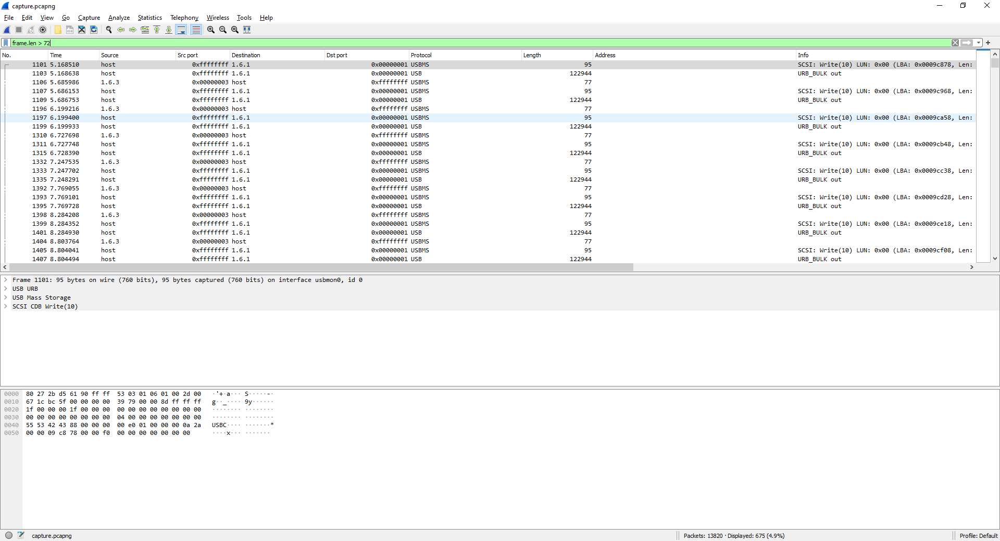
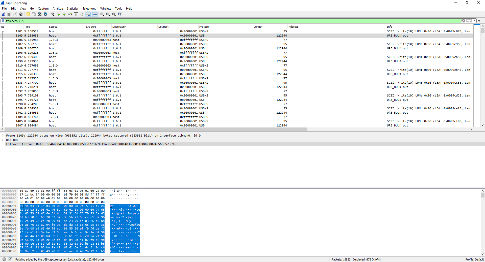
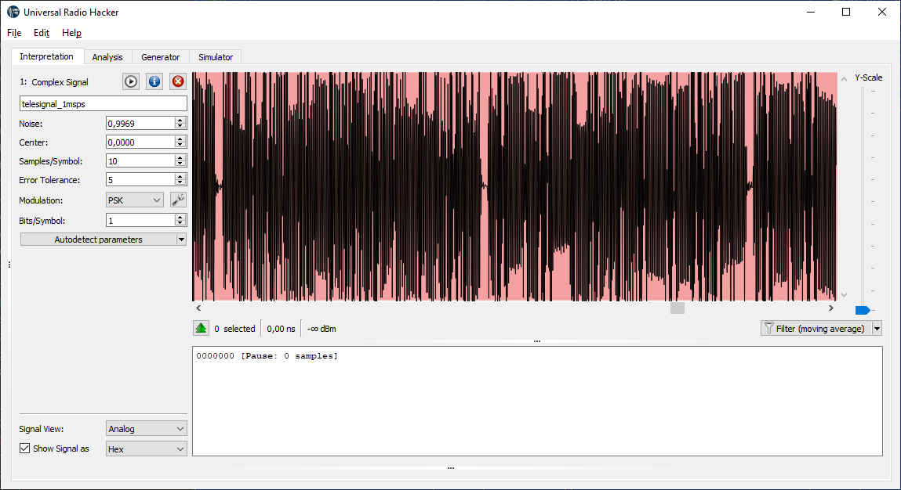

# Task 7



Open given pcap file in Wireshark:



Filter shorts packets:



Checking few packets found interesting file signature %))



After I switched to console and extracted data from interested packets:

```
"C:\Program Files\Wireshark\tshark.exe" -r data.pcapng -T fields -e usb.capdata -Y usb.capdata > capdata.raw
```

After I run binwalk on capdata.raw with option -e (extract all data),

as result "telesignal_1msps.complex32" was extracted.

Opened in URH:



Name of file (telesignal) and screenshot above gave me idea that it can be some TV signal ( image line by line ) but my knowledge of RF signals too small and I decided to switch to other task.

PS: if open hints:

- The transmission might contain polluted packets.
- Other default parameters might been tampered, but the capture was at 1Msps.
- ARFCN 34.

PPS: tried:
```bash
grgsm_decode -c telesignal_1msps_cut.complex -a 34 -v -s 1M -m XXX -t YYY
```
with different combinations of XXX and YYY - no succes :(
