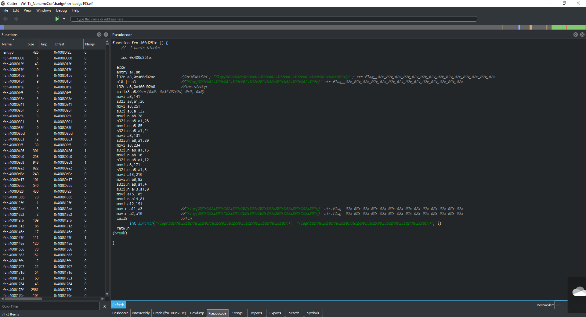

# Binary hero

_BlackVS/VVS way_

What we have:
- a badge with a new for me CPU/architecture (Xtensa). Well documented. It is good.
- available from manufacturer toolkits for programming/updating/dumping. Later we will see that this not needed for this task but helped to ... modify firmware to generate all flags at once %)

Let's start.
## Disassembling ... what exactly?
Ok, to disassemble/analyze something we should first get victim :)
Solving Mr. Bean Walker task, you already found first candidate for victim - *https://spynet.techmaker.ua/fw/nn-badge.bin*

Good start but... may be something more interesting in *https://spynet.techmaker.ua/fw/* folder can be found?

Let's see what is there... alleluia!

***https://spynet.techmaker.ua/fw/nn-badge.elf***

Jackpot (maybe).

Now we have bin and ELF at the same time - we have a very good start point for now.

## Disassembling ... using what?
Tools make world. 

Sure, bytecode analysis/coding is good but very slow way... (it is the last way if no other solutions found ^) - thanks to Espressif for good SDK/documentation.

### IDA. Very known and very old tool. Still alive and kicking %)
Surprise. Xtensa architecture is not supported by IDA from box. 

You can find few Python based plugins which can (theoretically) add support for this architecture to IDA but I failed going this way - neither IDA Pro 6.8 nor IDA Pro 7.0 correctly worked with plugins I found ^)
If somebody was able to success in this way - please share your experience with us %))

### Espressif toolkits/SDK
This architecture/CPU is quite good supported by manufacturer - you can download free SDK/toolkits for programming (and not only) this device.
For example, to disassemble ELF file:
```
xtensa-esp32-elf-objdump -dSgtr bootrom.elf > nn-badge192.elf.diasm
```
It is much better comparing to byte coding but... we have Radare2 %)

### Radare2 + Cutter
Because I was out of reverse engineering for a long time Radare2 was for a good surprise for me. 
Yes, It is strange a little bit (comparing to other tools) but it has own good made logic. 
And it can work in console! It is cool. Linux and GUI is not for me...
But to start faster you can choose Cutter - GUI for Radare2. And can you Windows or Linux - on your choice.
The latest release can be downloaded from [here](https://github.com/radareorg/cutter/releases).

## Disassembling ... finally
It is very easy - just run Cutter, choose downloaded before ELF file and set all analysis options %) (use default only is not enough in this case):


During Mr.Bean Walker task we reveal (I hope you too) very interesting string "flag{%02x%02x%02x%02x%02x%02x%02x%02x%02x%02x%02x%02x%02x%02x}".
I Especially if you know C++.

Let's locate it using Cutter:


Ok, here you are!
Now check XRefs for it (right click on string address and choose XRefs):


and... yessss - secret function found:


Now is the simplest - just to check it's results... simplest? Oh no, it was big mistake %)

Let's look on pseudo-code:



Nothing new.

Ok. We can run emulated code. Let's try:


Seems good, next... 


Good... what??????

Value 78 stored to a8 shown as 0xffffffce ? WTF (sorry for Code of conduct violation)... but it is really not good - emulation doesn't work properly for ESP32.

Finita la comedia?

Sure not %)

Let's relax and ... I remember 80x, I was too young... (I am sitting on the sun and drinking beer talking this story) ... we coded using... pen and sheet of paper. Really %)

Ok, let's start and... here are the results:


Flag is on this paper. If you don't see - ok, some hints below:

## Hint 1. ESP32 not using stack
It is true. This processor uses different approach - arguments to called function passed via registers (subset of a0...a15) and stored in buffer values ("window").

Registers a0 and a1 special.

Which registers used depends of call type.

In the case of **call8** registers shifted on 8 i.e. registers a10..a15 of caller function become a2..a7 in the called one.

## Hint 2. movi/movi.n
Store immediate value to specified register.
I.e.
```
movi.n a8, 78
```
means
```
a8 = 78
```

## Hint 3. s32i / s32i.n
Store value of first operand to the buffer (addressed by the second operand) with offset set by third operand. I.e.
```
s32i.n a8, a1, 28
```
means take value of register a8 and store to address a1+28:
```
a1[28]=a8
```
Be careful - 32 means 32-bit value i.e. 4 bytes size.

Offset is set in bytes. 

I.e. for packing 10 4-bytes values we should use offsets 0, 4, ..., 36.

## Hint 4. sprintf

If you [remember](http://www.cplusplus.com/reference/cstdio/sprintf/) - sprintf takes two obligatory arguments - output buffer and format string.
The amount of needed additional parameters depends on format string.
In our case format string is... 

flag{%02x%02x%02x%02x%02x%02x%02x%02x%02x%02x%02x%02x%02x%02x}

**%02x** - it means that needed integer value which will be printed as hex with exactly two hex digits in lower case.
I.e. 10 (decimal) will be printed as 0a in hex.
We need 14 such numbers.
*sprintf* called via *call8* - i.e. arguments passed using a10..a15.
The first two - a10 and a11 - used for output buffer and format (you can easily check this from code).
I.e. next registers - a12..a15 - used to pass next 4 arguments.
Rest 10 arguments passed via buffer. Address of buffer stored in a1.
Element addressed as a1+0, a1+4 ... a1+36.

What you need - just find values of a12, a13, a14, a15, a1+0, a1+4, ..., a1+36 before sprintf call %)

Let's try!

The road is made by walking; Walking makes the road
