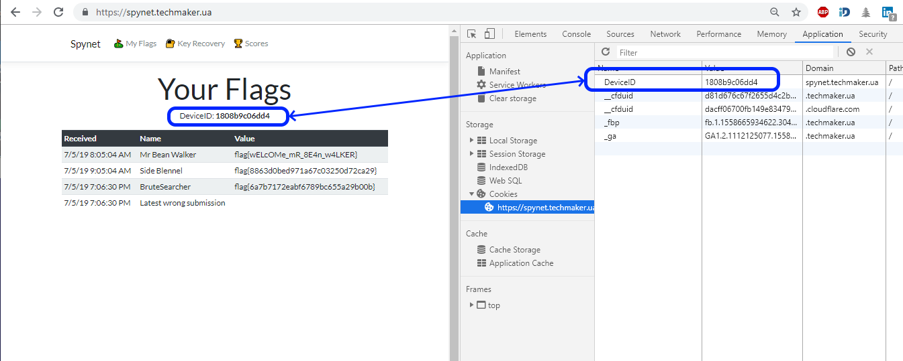

# Brute Searcher

Getting *mr.Bean Walker* flag we discovered remote firmware folder:


But may be https://spynet.techmaker.ua/ has more accessible folders?
Let's check

## dirb

Let's run *dirb* from **Kali** and ... voilà ::


## dirsearch 

If you don't have Kali you can download [dirsearch](https://github.com/maurosoria/dirsearch) tool and run it everywhere where Python present ^) :


## dirbuster

If you don't like Python but happy of Java %) - you can use **dirbuster**. It is included in [Kali](https://kali.tools/?p=116) as well as can be used standalone everywhere Java is (see at [OWASP](https://www.owasp.org/index.php/Category:OWASP_DirBuster_Project)).

## Capturing Flag

We discovered few more remote folders:

```
+ https://spynet.techmaker.ua/admin (CODE:401|SIZE:0)                          
+ https://spynet.techmaker.ua/Admin (CODE:401|SIZE:0)                          
+ https://spynet.techmaker.ua/ADMIN (CODE:401|SIZE:0)                          
+ https://spynet.techmaker.ua/docs (CODE:200|SIZE:249)                         
+ https://spynet.techmaker.ua/favicon.ico (CODE:200|SIZE:15086)                
+ https://spynet.techmaker.ua/fw (CODE:301|SIZE:0)                             
+ https://spynet.techmaker.ua/index (CODE:200|SIZE:3586)                       
+ https://spynet.techmaker.ua/Index (CODE:200|SIZE:3585)                       
```
First will check folders with return code 200 (OK) i.e. public available folders. It seems to be we got next prize:


Let's try download/open both discovered files (yep - *secret.txt* sounds very promising).

https://spynet.techmaker.ua/docs/secret.txt


PS: if you see "*flag{wrong deviceid}*" instead or error like this:


it means no DeviceID cookie present during download request. 

To fix this you can just login to your Badge page:


But if you don't look for easy ways you can manually add needed cookie directly in request. Name and value of cookie can be spied from Badge page:



This can be very helpful expirience for fulfilling "*NoNameCon SpyNet*" tasks later %))

After getting flag just register it on your badge:


<div align="center">

</div>


