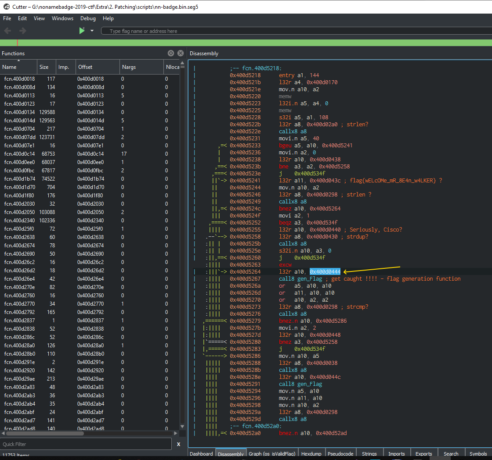

# Badge Firmware patching

## Part 1: analyzing

First download images for analyzing (they are already in *Scripts* folder):

https://spynet.techmaker.ua/fw/nn-badge.bin
https://spynet.techmaker.ua/fw/nn-badge.elf

Due to we intend modify firmware let make backup:

```bash
copy nn-badge.bin nn-badge.bak
```

Next disassemble firmware to get segments:

```bash
nnc_disassemble.py nn-badge.bin
```

You should see:

```bash
G:\nonamebadge-2019-ctf\Extra\2. Patching\scripts>nnc_disassemble.py nn-badge.bin
Image version: 1
Entry point: 40080ffc
secure_pad: False
flash_mode: 2
flash_size_freq: 32
6 segments

Segment 1: len 0x2bcb0 load 0x3f400020 file_offs 0x00000018
  addr=0x3f400020 file_offs=0x18 include_in_checksum=True

Segment 2: len 0x03614 load 0x3ffbdb60 file_offs 0x0002bcd0
  addr=0x3ffbdb60 file_offs=0x2bcd0 include_in_checksum=True

Segment 3: len 0x00400 load 0x40080000 file_offs 0x0002f2ec
  addr=0x40080000 file_offs=0x2f2ec include_in_checksum=True

Segment 4: len 0x00914 load 0x40080400 file_offs 0x0002f6f4
  addr=0x40080400 file_offs=0x2f6f4 include_in_checksum=True

Segment 5: len 0xd1f18 load 0x400d0018 file_offs 0x00030010
  addr=0x400d0018 file_offs=0x30010 include_in_checksum=True

Segment 6: len 0x15b64 load 0x40080d14 file_offs 0x00101f30
  addr=0x40080d14 file_offs=0x101f30 include_in_checksum=True

Checksum: 33 (valid)
Validation Hash: 94f0a1f483bf3b0db3ec20f26bf4f7dab910487b228b6d4885bfdf79562074f5 (valid)
END
```

We have 6 segments. Question is where is our point of interest located %)

Let's run radare2/cutter and open ELF file first (due to it may contain symbolic/debug information):


Locate "flag{.." string as we did in *Binary Hero* task:


Next X-Ref to functions which use this string (in our case it is single function):


It is already known from *Binary Hero* task function %)) :


But we will go deeper - let's scroll down and ... we will see *os_isValidFlag* function!


It seems we go in right direction!


Let's switch to pseudo-code generation mode 

(PS: I used Cutter v.1.8.2 due to the latest at this moment Cutter v1.8.3 is not supporting xtensa pseudo-code generation ^( ) :


Now we can reveal system functions like *strcmp* etc:


Also we see, that after successful check flag is sent via Wi-Fi:


Let's comment code to mark lines with system functions:


Hm, strcmp should get 2 arguemnts (due to it compares 2 strings... should compare two strings), by here we see that first string compared to ... zero string. Strange... it seems to be we have stripped ELF.

But we have bin file and we sure that it fully functional %)

Due to *os_isValidFlag* function start at 0x400d257b we need analyze segment 5:

Let's load it in the separate Cutter session (don't close Cutter with ELF session - we will need it later!):


And go to 0x400d257b and ... nothing - it is surely not our os_isValidFlag function.


It seems to be ELF and bin coded shifted to each other.

Let try locate our *os_isValidFlag* Function using power of radare2 %) :

Let's back to our ELF file, to the start of *os_isValidFlag* and remember first 4 bytes it starting with


Now back to out seg5 and let's search all such bytes in it via radare2 console:

```bash
/x 00362101 
```
and ... first hit successful. I've already renamed *fcn.400d5218* to *os_isValidFlag* for convinience:


Now let open both bin and elf files side by side to compare:


We see that code is different but similar - we easily can match code blocks:


Comparing code we can recognize sytem calls.
Also we see new function which not called in ELF file - 0x400d5108:


It seems to be our flag generation function which was substituted by zero string in ELF file. Let's rename it and check our commented code:


Now much better - code is readable %) 

Let check flag generation function - it is main point of interest for people who wish unwind it %))) :


But we will back to our *os_isValidFlag* function:



We see that each gen_flag call receives some argument. Let check what exactly passed to it:


Yep... we need load *seg1* to continue:


Here is... secret "phrase"?
It seems that generating function accepts only secret phrase, different for each flag and generate flag basing on this phrase and... device id? Who knows %)

Let check our hypothese:


Yep. all secret phrases found.
Now we can... we can patch firmware to generate and print flags when we wish %) 
