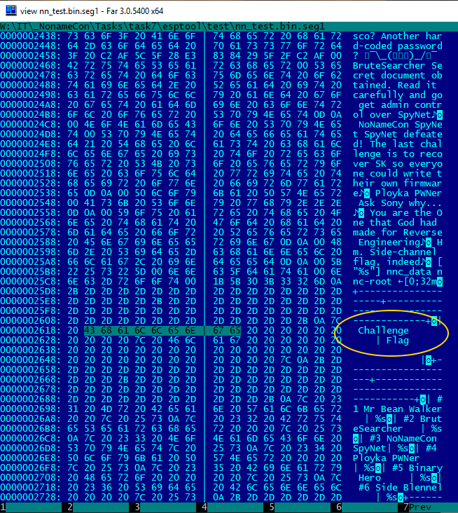
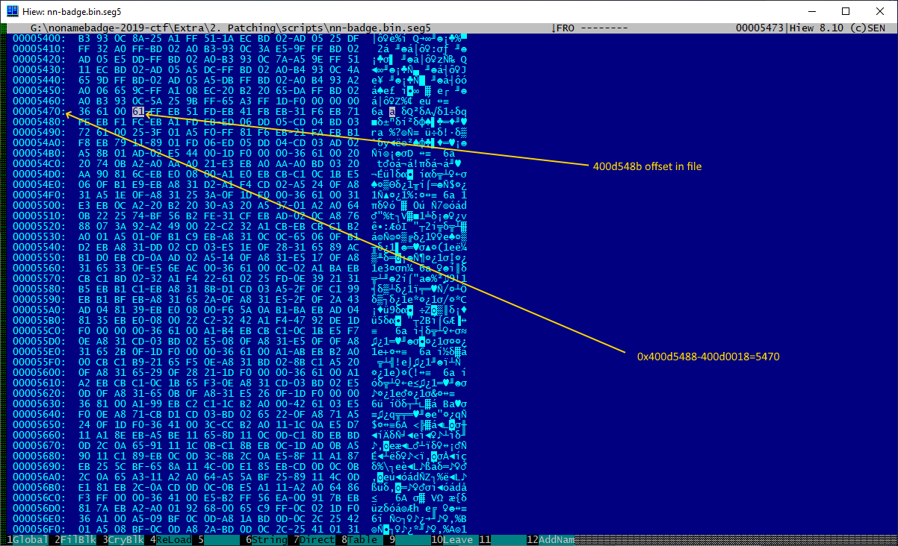

# Badge Firmware patching

## Part 2: patching (to get all flags)

Turn on our badge, connect to it via terminal and check flags.
As you see - no flags (I did factory reset before to ensure):


The main idea is:
- from [Part1: analyzing](part1.md) we know flag generation function and arguments which should be passed to it to get flag
- we need modify firmware to generate all flags when we need them
- simplest and straigt solution as for me is ... modify *flag* command (see screenshot above) %)
- to find code implementation of this function we can start from static text string printed at the flag command execution i.e. "Challenge..."

This string can be easily found both in binary:



and in radare2/Cutter:


Next we need to locate start of string (due to "*Challenge*" is in the middle of *flag* command output).
It is quite easy due to firmware written using C and use zero-terminated strings:


i.e. 0x3f4025f0 - address of needed string.

Let’s try locate who use it.
Try search for bytes **f0 25 40 3f** (Little Endian byte order!) :


Yep, we have one hit, super %) :


But as we see it is in data segment (you may switch from hex to disassemble view to ensure).

I.e. it is cell which stores address - it is usual for dynamic linked libraries for example.

Try to find who is refering to this cell:


Hm, no hits.
Problem? Not!
X-tensa architecture uses removable code i.e. links/references can be set as offset from current position.
Now we need real power of radare2!


Command "/c" means to search text in the disassembled code. It is real cool feature - and we have a hit!

Let's check found hit :


and go to the beginning of function containing this hit:


We found flags printing function. Simple.

Let's switch on showing hex codes in disaassemble view:


Now it is the ... no, not simplest.

Hardest %))

Why - radare2 does not support yet inserting assembler code for X-Tensa - you may try check this: right click on any code, Edit, instructions and.. entering any instruction gives "Unknown instruction..."

You can only insert byte-code. It can be helpful in our case due to entering byte code you immediately see corresponding asm-code (due to radare2 can disassemble x-tensa %) 

It was my first solution - I entered byte-codes until got needed instructions.

Trust me - due to bugs this way is slow and hard %)))

But we just need way generate correct byte codes for just two instructions - call8 and l32r.

Why?

All code which I wish to create is:

```asm
|           0x400d548b      call8 fcn.400d51bc ; fcn.400d51ba+0x2
                            call8 printf ; 0x400d689c
                            l32r a10, 0x400d0444
                            call8 gen_flag
                            call8 printf ; 0x400d689c
                            l32r a10, 0x400d044c
                            call8 gen_flag
                            call8 printf ; 0x400d689c
                            l32r a10, 0x400d0454
                            call8 gen_flag
                            call8 printf ; 0x400d689c
                            l32r a10, 0x400d0460
                            call8 gen_flag
                            call8 printf ; 0x400d689c
                            l32r a10, 0x400d043c
                            call8 printf ; 0x400d689c
                            retw.n
```

*retw.n* is always **1d f0** (we can see it from picture above)

But call8 and l32r use relative addressing i.e. offset from current position:


I wrote simple Python3 code to generate needed code:

```python
#!/usr/bin/env python
import sys
import argparse
from binascii import *


def rshift(val,n):
    mask1 = 0x80000000
    sign = (val & mask1)
    mask3 = (~((1<<(32-n))-1), 0)[sign==0] #python support big numbers
    return (val>>n) | mask3

#The target instruction
#address of the call is given by the address of the CALL8 instruction with the two
#least significant bits set to zero, plus the sign-extended 18-bit offset field of the instruction
#shifted by two, plus four.
def make_call8(pc,offset):
    start=pc&~0b11
    if offset&0b11:
        print("Offset must have 2 lowest bits equal to zero i.e. 4 bytes aligned")
        return
    # offset = pc + (diff<<<2) + 4 => 
    diff= ( offset - start - 4 ) 
    # instraction = offset (18bit) + 10 + 0101
    byte0 = 0b100101 |( ( diff & 0b1100 )<<4)
    byte1 = (diff & 0b111111110000) >> 4
    byte2 = (diff & 0b11111111000000000000) >> 12
    print("{:08x}: call8 {:08x} = {:02x} {:02x} {:02x}".format(pc, offset, byte0, byte1, byte2))
    return pc+3

#L32R forms a virtual address by adding the 16-bit one-extended constant value encoded
#in the instruction word shifted left by two to the address of the L32R plus three with the
#two least significant bits cleared. Therefore, the offset can always specify 32-bit aligned
#addresses from -262141 to -4 bytes from the address of the L32R instruction. 32 bits
#(four bytes) are read from the physical address. This data is then written to address
#register at.
#  offset = (0b11111111 | imm16) << 2 + 
#  start = ( (pc + 3) & ~0b11 )
#  offset = (0b11111111 | imm16) << 2 + start
#  imm16 = ( (offset - start) >>> 2 ) & 0b11111111

#   where >>> is argipmhetic shift, rshift

def make_l32r(pc,regNum,offset):
    start = (pc+3) & ~0b11
    byte0 = 0b0001 | ( regNum << 4 )
    imm16 = rshift( offset - start, 2 )
    byte1 = imm16 & 0xff
    byte2 = (imm16>>8) & 0xff
    print("{:08x}: l32r a{}, {:08x} = {:02x} {:02x} {:02x}".format(pc, regNum, offset, byte0, byte1, byte2)) #LE
    return pc+3


#            0x400d5488      366100                 entry a1, 48
#            0x400d548b      call8 fcn.400d51bc ; fcn.400d51ba+0x2
#                            call8 printf ; 0x400d689c
#                            l32r a10, 0x400d0444
#                            call8 gen_flag
#                            call8 printf ; 0x400d689c
#                            l32r a10, 0x400d044c
#                            call8 gen_flag
#                            call8 printf ; 0x400d689c
#                            l32r a10, 0x400d0454
#                            call8 gen_flag
#                            call8 printf ; 0x400d689c
#                            l32r a10, 0x400d0460
#                            call8 gen_flag
#                            call8 printf ; 0x400d689c
#                            l32r a10, 0x400d043c
#                            call8 printf ; 0x400d689c


if __name__ == '__main__':
    #0x400d5494      a1eceb                 l32r a10, 0x400d0444
    #pc=0x400d5494
    #pc=make_l32r(pc, 10, 0x400d0444) # => a1 ec eb

    pc=0x400d548b
    pc=make_call8(pc, 0x400d51bc) #hidden flag
    pc=make_call8(pc, 0x400d689c) #printf
    pc=make_l32r(pc, 10, 0x400d0444) #l32r a10, 0x400d0444
    pc=make_call8(pc, 0x400d5108) #gen_flag
    pc=make_call8(pc, 0x400d689c) #printf
    pc=make_l32r(pc,  10, 0x400d044c) #l32r a10, 0x400d044c
    pc=make_call8(pc, 0x400d5108) #gen_flag
    pc=make_call8(pc, 0x400d689c) #printf
    pc=make_l32r(pc,  10, 0x400d0454) #l32r a10, 0x400d0454
    pc=make_call8(pc, 0x400d5108) #gen_flag
    pc=make_call8(pc, 0x400d689c) #printf
    pc=make_l32r(pc,  10, 0x400d0460) #l32r a10, 0x400d0460
    pc=make_call8(pc, 0x400d5108) #gen_flag
    pc=make_call8(pc, 0x400d689c) #printf
    pc=make_l32r(pc,  10, 0x400d043c) #Welcome flag
    pc=make_call8(pc, 0x400d689c) #printf

```

The output of code is:

```bash
400d548b: call8 400d51bc = 25 d3 ff
400d548e: call8 400d689c = e5 40 01
400d5491: l32r a10, 400d0444 = a1 ec eb
400d5494: call8 400d5108 = 25 c7 ff
400d5497: call8 400d689c = 65 40 01
400d549a: l32r a10, 400d044c = a1 ec eb
400d549d: call8 400d5108 = a5 c6 ff
400d54a0: call8 400d689c = a5 3f 01
400d54a3: l32r a10, 400d0454 = a1 ec eb
400d54a6: call8 400d5108 = 25 c6 ff
400d54a9: call8 400d689c = 25 3f 01
400d54ac: l32r a10, 400d0460 = a1 ed eb
400d54af: call8 400d5108 = a5 c5 ff
400d54b2: call8 400d689c = a5 3e 01
400d54b5: l32r a10, 400d043c = a1 e1 eb
400d54b8: call8 400d689c = 25 3e 01
```

All you need is just put these codes in proper place ^) :




Let's check modified binary in radare2/Cutter - good, 100% correct code:


Now assemble firmware from segments (including modified one):

```bash
nnc_assemble.py nn-badge.bin.map nn-badge-patched.bin

G:\nonamebadge-2019-ctf\Extra\2. Patching\scripts>nnc_assemble.py nn-badge.bin.map nn-badge-patched.bin
Entrypoint: 40080ffc
The number of segments: 6
1: file=nn-badge.bin.seg1 map=3f400020 file_ofs=00000018 in_checksum=True
2: file=nn-badge.bin.seg2 map=3ffbdb60 file_ofs=0002bcd0 in_checksum=True
3: file=nn-badge.bin.seg3 map=40080000 file_ofs=0002f2ec in_checksum=True
4: file=nn-badge.bin.seg4 map=40080400 file_ofs=0002f6f4 in_checksum=True
5: file=nn-badge.bin.seg5 map=400d0018 file_ofs=00030010 in_checksum=True
6: file=nn-badge.bin.seg6 map=40080d14 file_ofs=00101f30 in_checksum=True

```

Due to I patched in-place - no modifying of map file needed:


Sign, verify and flash patched firmware:

```bash
espsecure.py sign_data -k private.pem nn-badge-patched.bin
espsecure.py verify_signature -k public.key nn-badge-patched.bin
esptool.py --chip esp32 image_info nn-badge-patched.bin
esptool.py -p com4 -c esp32 write_flash 0x190000 nn-badge-patched.bin
```


Connect to badge and ... it is alive!

Cool. Let's run "flags" command:


Output is little bit ridiculous but we see all flags %) 
Let's verify all them - 
Success.

Ok, let flash original, non patched, firmware (due to we disabled wi-fi connection in the original "flag" command ):

```bash
esptool.py -p com4 -c esp32 write_flash 0x190000 nn-badge.bin
```

Connect to badge and ... - yes, we got all flags 


and we are successfully registered them:


<div align="center">

</div>


<div align="center">


<b>Full success %)</b>
</div>
