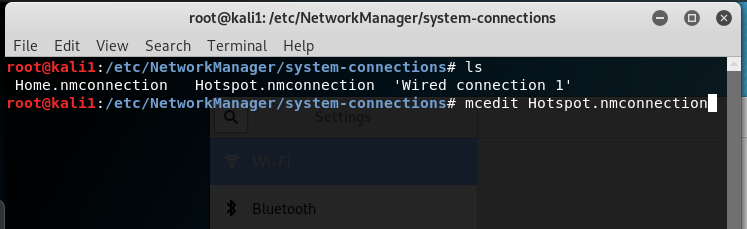
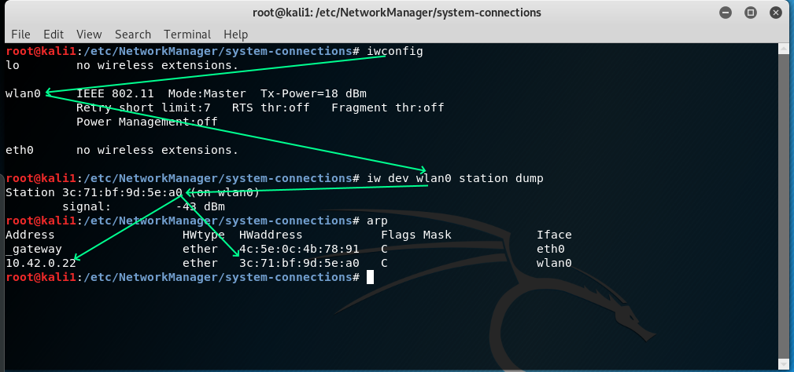

# Route/intercept traffic from/to badge

To implement MITM attack we must first to intercept traffic to/from badge.

## Hotspot (Kali)
Due to badge can connect to any (or about any %) Wi-Fi hotspot using DHCP client - just create custom hotspot.

Standart Kali image uses Network Manager to manage network.

If you switch Wi-Fi to Hotspot mode it will create hotspot with:

* SSID equal to hostname (kali1 in my case)
* WPA2 
* password - randomly generated

If you wish change some parameters you may modify them via (in console):

```bash
nmtui
```
or

```bash
nm-connection-editor
```

For example, I changed password to test1234:


switched Hotspot on:


joined badge to this hotspot:


and... got:


 

Google said that it seems to be badge not able use chosen in Kali by default security settings.

Let's relax them.

All connections properties stored in */etc/NetworkManager/system-connections/* folder. Let edit connection started with "*Hotspot*" - in my case "Hotspot.nmconnection":



and change security settings to:

```
[wifi-security]
group=ccmp;tkip;
key-mgmt=wpa-psk
pairwise=ccmp;tkip;
proto=wpa;
psk=test1234
```


After run in console (or Network Manager will rewrite your changes):

```
nmcli conn reload
```

and restart your Hotspot.

As only badge reconnected to your hotspot your will see:


Next we have to get all needed information for next steps:




For Kali
* WiFi interfaces and ip (**wlan0** : 10.42.0.1/24). All traffic to/from badge comnes through this interface.
* interface with access to Internet (**eth0** : 192.168.6.200/24, Internet gateway/DNS server is 192.168.6.1/24)
* forwarding is enabled i.e. Kali acts as router
* all forwarded traffic to/from wlan0 is masquaraded (not the best solution for us but it was done by Network Manager by default). For Kali-as-router better solution would be to masquarade forwarded to *eth0* traffic.
* Kali acts as DNS proxy/DHCP server for wlan0

For badge:
* MAC and ip address: 3c:71:bf:9d:5e:a0, 10.42.0.22/24
* DNS request sent to Kali


## Kali (hotspot based on hostapd+dnsmasq)

https://cybergibbons.com/security-2/quick-and-easy-fake-wifi-access-point-in-kali/

https://nims11.wordpress.com/2012/04/27/hostapd-the-linux-way-to-create-virtual-wifi-access-point/comment-page-5/

https://github.com/BASH-Auto-Tools/wifi-host-ap-bash

## External AP with gateway for badge set (via DHCP) to ip of Kali 
How to do this depends on contrete AP you use.

## Arp spoofing 
Can be usefull (and one of possible ways) when you haven't physical access to badge.

But be carefull - arp spoofing may infect arp tables not only of desired targets but any devices which receive infected arp traffic (i.e. for example have network cards in promiscoius 
mode).

https://www.valbrux.it/blog/2017/11/26/mitm-using-arpspoof-burp-or-mitmproxy-on-kali-linux/

## Intercepting traffic (the first try)

First redirect https traffic to other port (where MITM proxy is hosted):

```bash
iptables -t nat -A PREROUTING -i wlan0 -p tcp --dport 443 -j REDIRECT --to-port 8080
```

### mitmproxy

```bash
mitmproxy --mode transparent -p 8080
```
and ...


in CA we don't trust ... 
yep.
Badge has build-in check for remote CA certificate - we must somehow to deal with this stuff %)