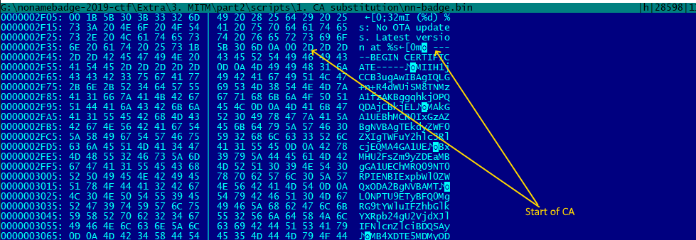
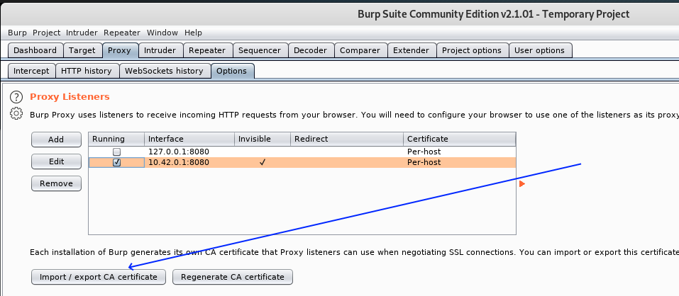
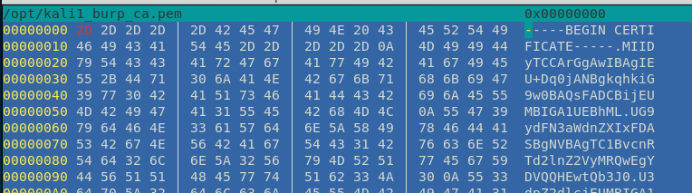

# 3. CA stuff

## 3.1. Changing built-in in firmware CA certificate

It is easy to see that badge firmware has built-in certificate - 




Certificate in PEM (i.e. base64) format - it is important!

For convinience I extracted it to *.\Extra\3. MITM\part2\scripts\1. CA substitution"\badge_cert_ca.cer* and check using standard Windows tools:


Or using *certutil* :


I.e. it is full-chain CA certificate to verify remote server.

Let's try substitute it by our one.

I will use Burp Suite here for MITM.

What we have to do:

* export CA certificate from Burp Suit (don't use my - it is different for different Burp Suits installations!)
* convert it in proper format
* insert it in firmware image
* flash
* enjoy

### Getting CA from Burp Suite




Certificate in DER (i.e. raw ASN format):


We need convert it to PEM.

To convert it to PEM in Windows:

```bash
certutil -encode kali1_burp_ca.der kali1_burp_ca.pem
```

or in Linux:

```bash
openssl x509 -inform der -in kali1_burp_ca.der -out kali1_burp_ca.pem
```

Check :




Important - certificate ends with 0x0a symbol. We need add 0x00 byte to the end due to formware uses C-style strings.

To do this just type in Linux (or use any other tool like Hiew, FlexHex, WinHex in Windows):

```bash
truncate -s +1 kali1_burp_ca.pem
```
i.e. we are "truncating" file on -1 bytes i.e. adding 1 zero-byte %)


Good.

Now we are ready to replace original CA certificate with our us.

To do this first disassemble image:

```bash
nnc_disassemble.py nn-badge.bin
```

And check all segments for original CA certificate - it is in *nn-badge.bin.seg1* :


CA starts from 0x2f22 offset and ends in 0x431e. Length of certificate is 0x13fd (5117) bytes including final zero-byte (that why we added zero to our certificate).

Our certificate much shorter - in my case 0x560 (1376) bytes i.e. we may just put it inplace of old:

```bash
cp nn-badge.bin.seg1 nn-badge.bin.seg1.orig
dd bs=1 seek=$((0x2f22)) conv=notrunc if=kali1_burp_ca.pem of=nn-badge.bin.seg1
```

(or use any other hex tool to do this).


Compare original and patched files:


Looks good.

Assemble patched image:
```bash
nnc_assemble.py nn-badge.bin.map nn-badge-patched.bin
```

Sign it:
```bash
espsecure.py sign_data -k private.pem nn-badge-patched.bin
```

Verify:
```bash
espsecure.py verify_signature -k public.key nn-badge-patched.bin
```

Flash:
```bash
esptool.py -p com4 -c esp32 write_flash 0x190000 nn-badge-patched.bin
```


Connect to badge and .. it alive!!! :


and able coonect to remote site %) :


and we able to inspect secure traffic:


## 3.2. Disabling CA cert check (4 bytes decision %)

## Check [4-bytes solution](README_0x4.md)