# 3.2. Disabling CA cert check (4 bytes decision %)

As we see in previous part - to allow MITM we have to ptach badge firmware with own CA certificate.

If we change server with MITM or use difefrent MITM proxy software - we have to re-assemble new firmware with new CA certificate.

Or use the same CA certificate in all MITM proxies for concrete patched firmware.

Not very convinient.

May be we can fix this?

Let's check notifications for situation when we use original badge firmware and MITM proxy:

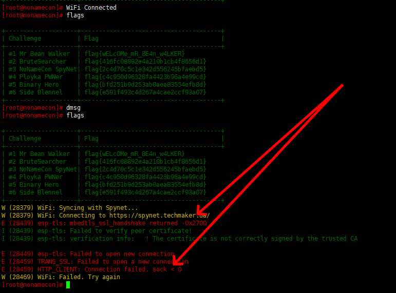

We see debug messages which includes also modules names/specific labels:

* WiFi
* esp-tls
* TRANS_SSL
* HTTP_CLIENT
 
Remember them!!!


Let's load firmware in Radare2 and try to locate point in the code where any of these messages are printed.

Due to I'm very lazy man I prepared special *badge_bin_sects.elf* which combines segments from BIN file with debug/symbol data from ELF. It makes reverse engineering life much easier.

(How I did this is separate story...)


Let's check for *spynet.techmaker.ua* url in code:

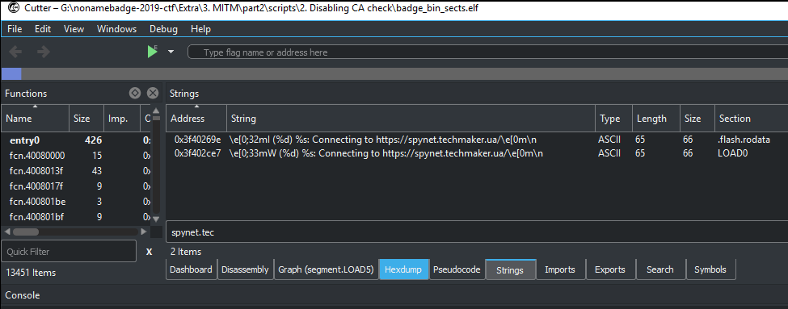

Go to the code which uses this URL:

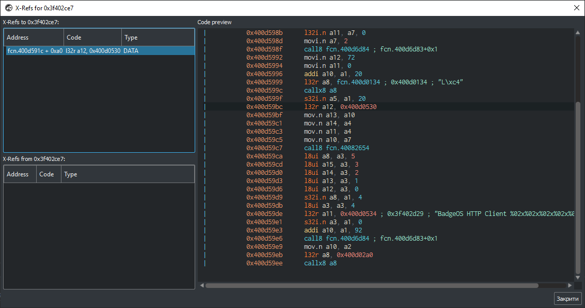

Scroll up little bit ...

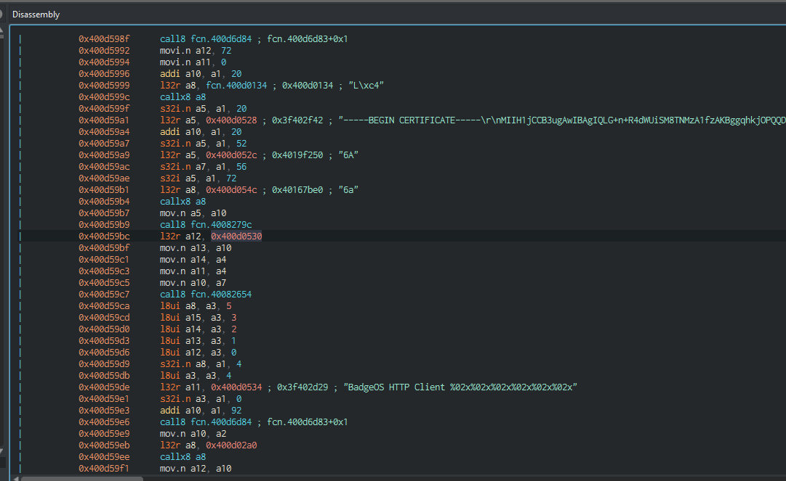

and we see also our built-in CA certifica here! We go in right direction.

Let's check function to which passed built-in CA.

Adrees of fanction stored at 0x400d054c (idirect call):

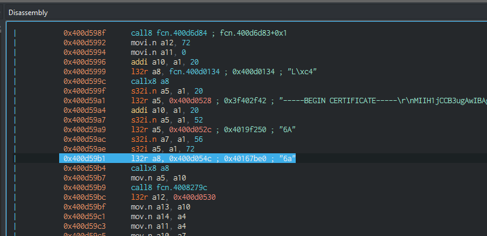

Function has address 0x40167be0:

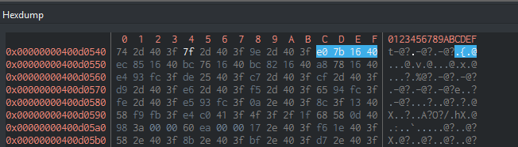

Let's look closer:

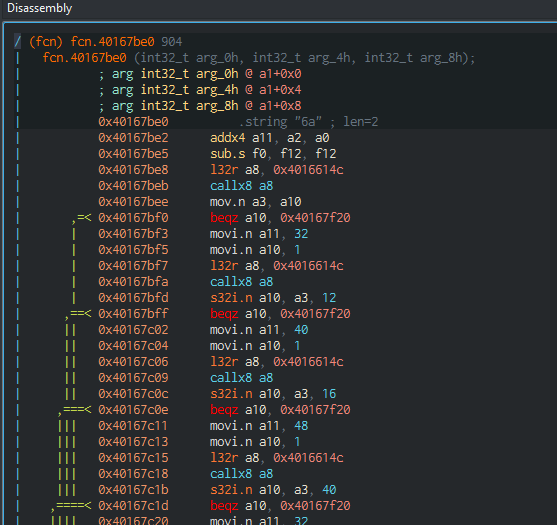

scroll down and ... yep - we saw debugimg info:

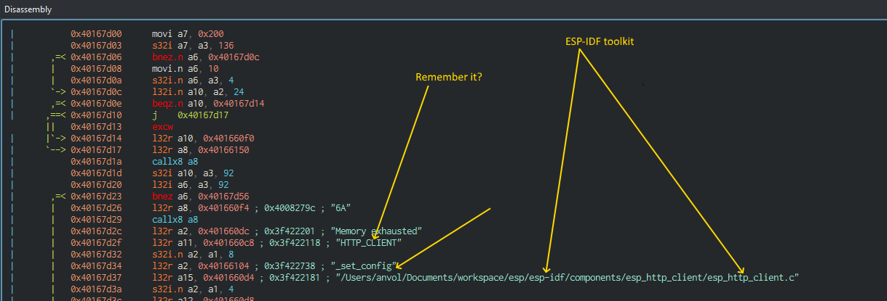

I.e. it is call to function in esp_http_client.c - standard ESP-IDF library (thanks to Anvol for diganostic/debug messages %).

ESP-IDF available from https://github.com/espressif/esp-idf :

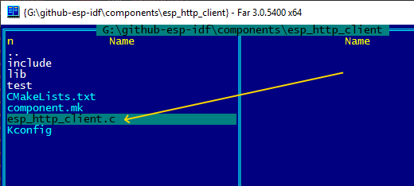

But I copied few files for you to *scripts/2. Disabling CA check/esp-idf* folder.

It seems to be found function is (may be I'm wrong but looks very similar %) :

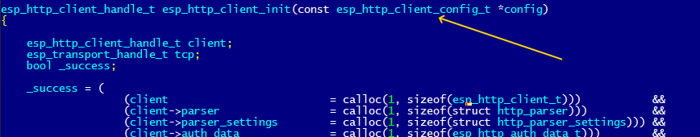

Let's check passed to it argument type:

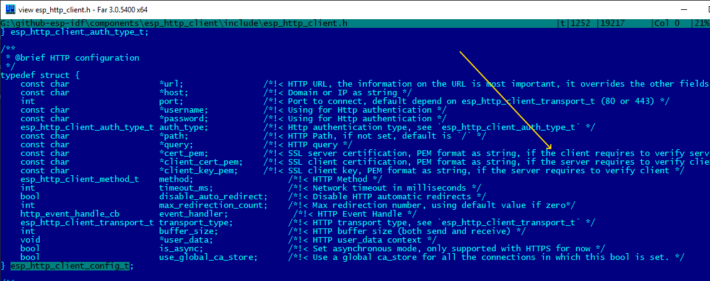

Hm, "if the client requires to verify server..." ... but if not? %)

On the first screenshot we saw "*esp-tls*" and .. we found corresponding files in ESP-IDF toolkit %) 

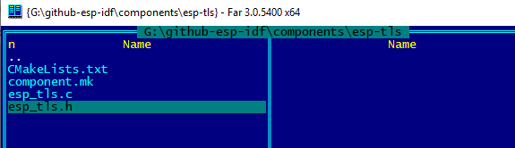

Some code investigations:

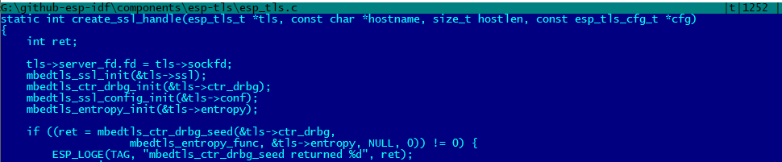

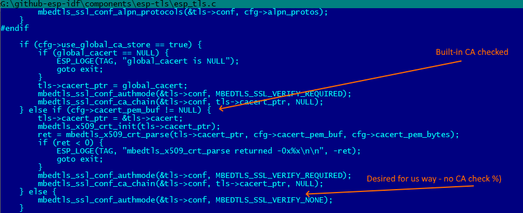

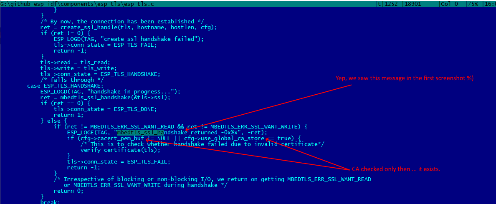

I.e. it seems if instead of CA certificate we will pass just zero-point server's identity will not be checked.

Let's check this idea.

Certificate address stored at 0x400d0528 :

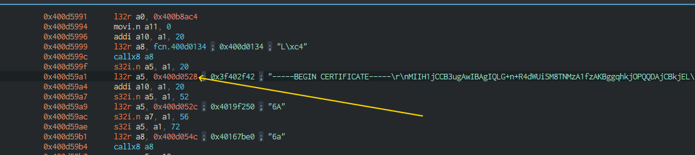

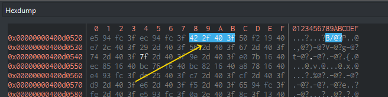

From badge info :

```bash
Image version: 1
Entry point: 40080ffc
secure_pad: False
flash_mode: 2
flash_size_freq: 32
6 segments

Segment 1: len 0x2bcb0 load 0x3f400020 file_offs 0x00000018
  addr=0x3f400020 file_offs=0x18 include_in_checksum=True

Segment 2: len 0x03614 load 0x3ffbdb60 file_offs 0x0002bcd0
  addr=0x3ffbdb60 file_offs=0x2bcd0 include_in_checksum=True

Segment 3: len 0x00400 load 0x40080000 file_offs 0x0002f2ec
  addr=0x40080000 file_offs=0x2f2ec include_in_checksum=True

Segment 4: len 0x00914 load 0x40080400 file_offs 0x0002f6f4
  addr=0x40080400 file_offs=0x2f6f4 include_in_checksum=True

Segment 5: len 0xd1f18 load 0x400d0018 file_offs 0x00030010
  addr=0x400d0018 file_offs=0x30010 include_in_checksum=True

Segment 6: len 0x15b64 load 0x40080d14 file_offs 0x00101f30
  addr=0x40080d14 file_offs=0x101f30 include_in_checksum=True

Checksum: 33 (valid)
```

needed segment for patching is segment 5.

Offset in segment file is 0x400d0528-0x400d0018=0x510 :

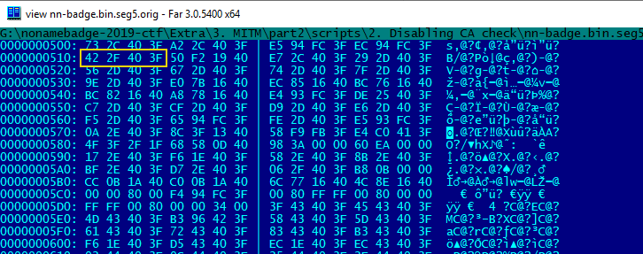

Just make them zero, assemble, sign, verify and flash %)

And enjoy - now badge "trusts" to any remote server %)