# Intro. Mr. Bean Walker and .. Doom?

## 0. Turn badge on
First of all you have to attach your badge to computer and connect to it via terminal. 

Correspondent instructions can be found at official NonameCon Badge [page](https://nonamecon.org/badge).
After connecting first try 'help' - works :)

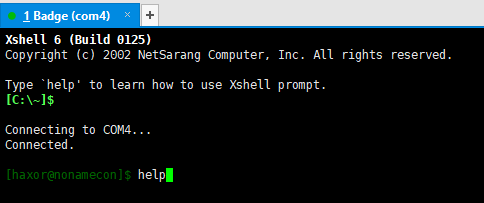

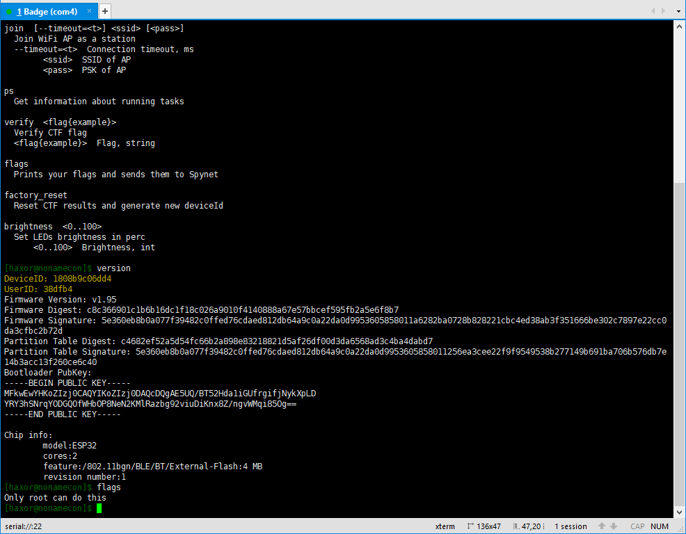

Good. Next try all commands mentioned in the help output:

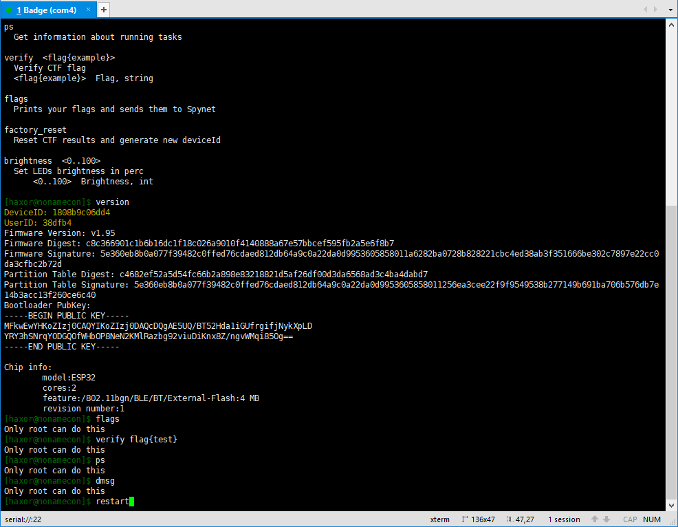

Not good - we need root to run most of them.

But it seems *restart* works:


We see a lot of very interesting information including hint at the end.

Ok, now we need find mentioned trailer. Badge trailer. Google will help to us ^)

It was found at the official NonameCon Youtube channel - here it is: [NoNameCon Badge Trailer](https://www.youtube.com/watch?v=chfoAWevHMs)

## 1. Watch and enjoy trailer at Youtube

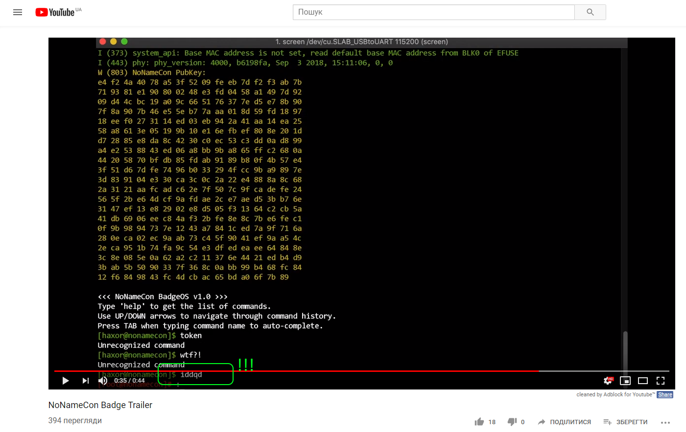

Yep, interesting... but what it is????
Password?????
Yesssssss

## 2. Get root
Let's try 'iddqd' found in video in terminal:

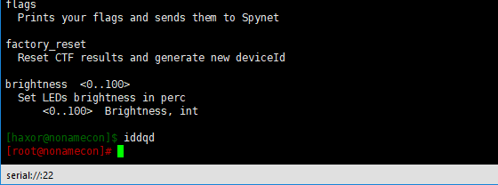

Super:

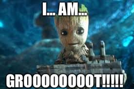

(hands themselves type 'idkfa' %) Yep, it is not [Doom](http://lurkmore.to/IDDQD) :))

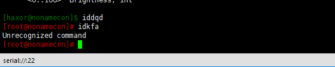

Let's try other commands, for example:

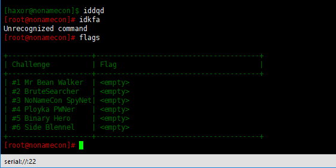

Ok. We have root. Now we need flags %)

## 3. Get the first flag

Check rest commands like *dmsg*, *join* etc.
For example, try connect badge to Wi-Fi:

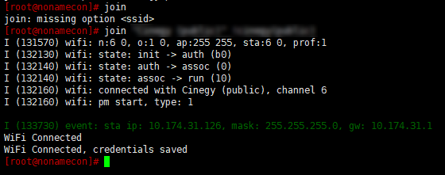

and... after some time we will see diagnostic message:

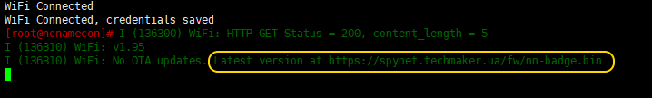

Very interesting. Can we download firmware manually? Yes, we can %)
But let's check folder with binary:

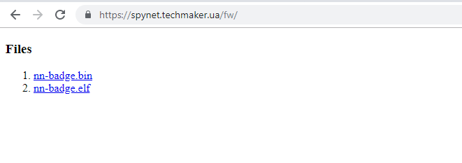

Ok, we have both **bin** and **ELF** images - very good. Let's analyze them.
First of all check for strings inside:

```
rabin2.exe -zz nn-badge195.bin
```

if you have **radare2** installed

or 

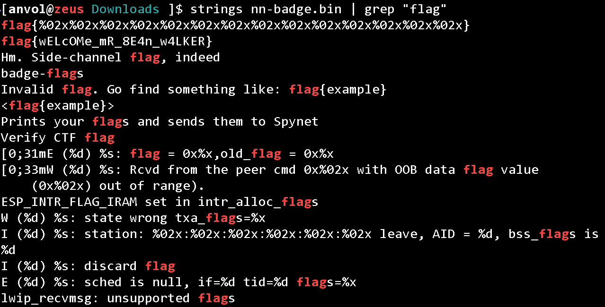

if you have Kali.

I used... FAR %) :

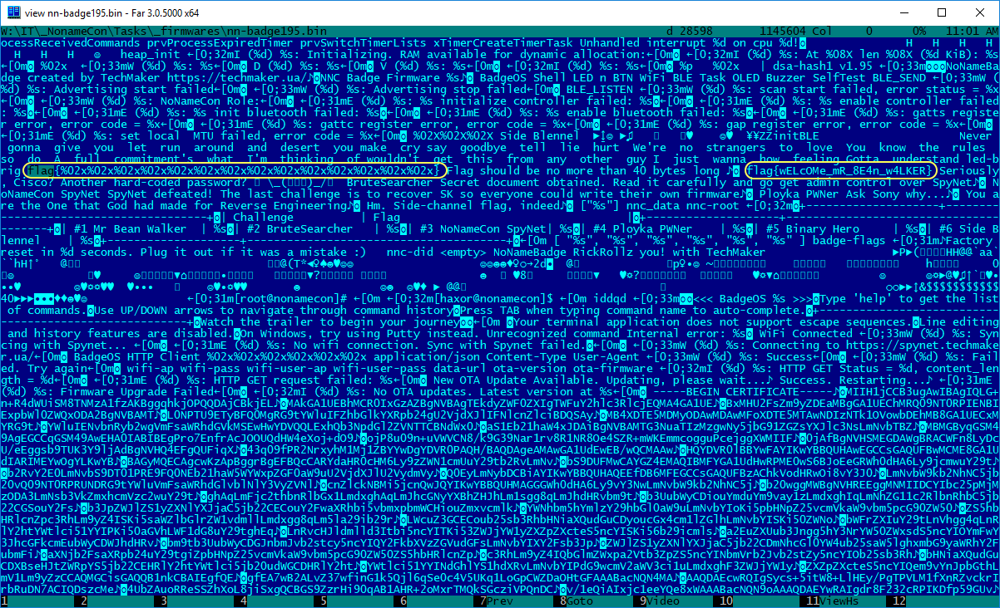

Ok, it seems to be found hard-coded flag - let's check it:

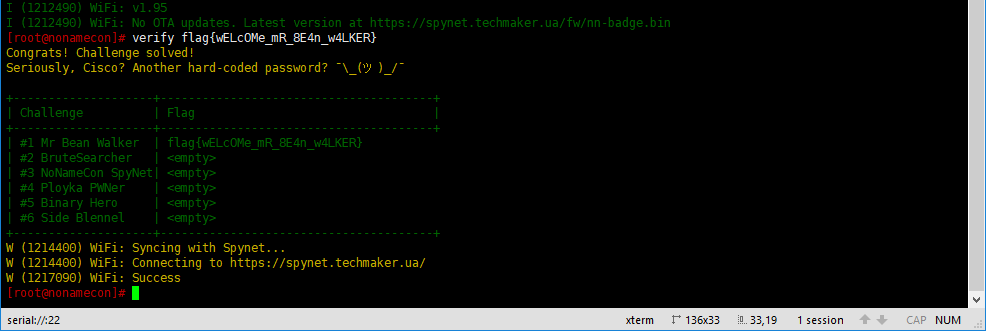

Yehhho!!!

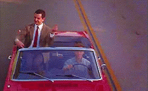
