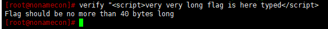
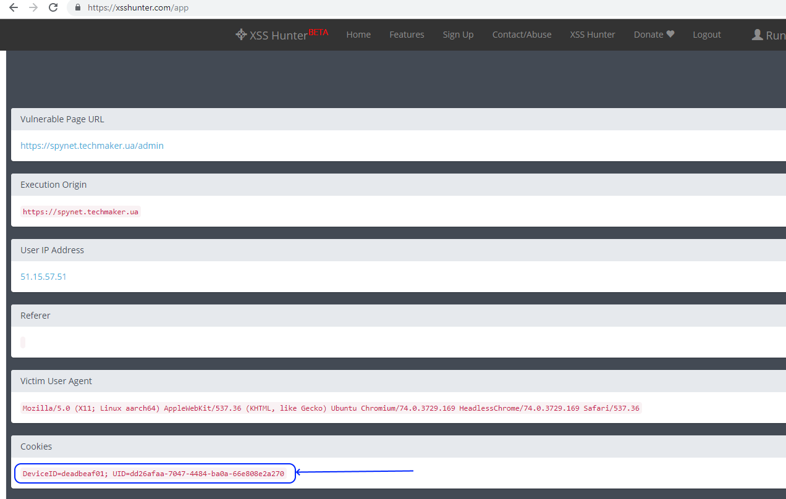

# NoNameCon SpyNet
*(c) comics by VVS*

Fulfilling BrutSearcher task we discovered https://spynet.techmaker.ua/admin/ - time take a closer look.
Sure, trying access it gives HTTP ERROR 401.

Ok. Let's try [XSS](https://www.owasp.org/index.php/Cross-site_Scripting_(XSS)) 

First candidate for injection is DeviceID, for example, let's try 
```DeviceID=<script>alert()</script>```


... not succeeded.

Ok, next user input, which displayed by SpyNet is... flags in terminal:


Yehhho!!! XSS injection possible.

Which limitations we have:
* we can't do flags longer 40 bytes:


 
* due to we intend to catch admin's cookies we need save intercepted information somewhere globally accessed from Techmakers site.

Starting from this point next scenarious possible:
1. If you have own site which quit short URL - you can use it. It was the first my scenarios - I prepared small JS script at my server and injected instead flag URL to it. Stolen cookies were written into the text file.

2. About the same as variant 1 but ... cookies were sent to me via Telegram bot %)

3. Later I was pushed to shorter way - [XSS Hunter](https://xsshunter.com/):

First sign up:
hint - make *yoursubdomain* during signup shorter as possible (remember 40 chars limit? ):


On fetaure page you will found code for injection (just replace *yoursubdomain* with your subdomain which your set during signup)


Then put your injection code instead flag name in terminal:


and ... wait. 

After some period (~5 minutes) your will receive notification mail from XSS Hunter.
Also in XSS Fires seection you will see that SpyNet got caught in XSS nets %) :


Here are cookies:


At my first try I used [PostMan](https://www.getpostman.com/) - it very easy to add/remove cookies for any request.

In the case of Chrome we should little bit to dance - it not allows add cookie (directly or via JS command in console) for https://spynet.techmaker.ua/admin .

What I did in Chrome:

* added stolen cookies for https://spynet.techmaker.ua/ page:


it seems to fail but be patient! Just switch to https://spynet.techmaker.ua/admin/ page :


Ok, we near to win. Wrong DeviceID - ok will change it to our one:


- flag captured!


and accepted.


Used links:
https://xsshunter.com/signup
https://xsshunter.com/features
https://xsshunter.com/app
https://spynet.techmaker.ua/admin/
