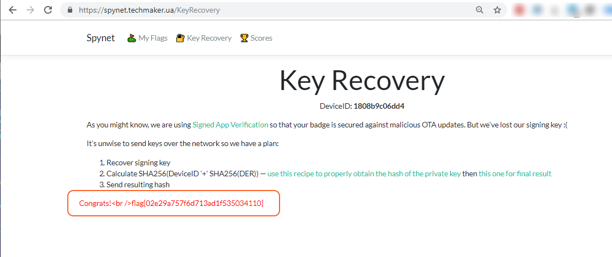

# Ployka PWNer

## Intro:

**Ployka (плойка)** - it is informal name of PlayStation in Russian

Getting NoNameCon SpyNet flags we saw help message:


Also some hints given by PS3 history itself:

**ECDSA**
https://en.wikipedia.org/wiki/Elliptic_Curve_Digital_Signature_Algorithm

**PS3**

Wiki writes: *In August 2013, it was revealed that bugs in some implementations of the Java class SecureRandom sometimes generated collisions in the {\displaystyle k} k value. This allowed hackers to recover private keys giving them the same control over bitcoin transactions as legitimate keys' owners had, using the same exploit that was used to reveal the PS3 signing key on some Android app implementations, which use Java and rely on ECDSA to authenticate transactions.[11]*

**PS3 breakdown**

https://xakep.ru/2012/10/26/59539/

Additional hints can be found via Key Recovery page:
 


Check all links provided on this page:

http://tiny.cc/nnc-esp-signed-app

http://tiny.cc/nnc-sha-sk

http://tiny.cc/nnc-sha-result

I.e. it seems to be we have to:
* restore private key
* generate Recovery Key as SHA256(DeviceID '+' SHA256(DER)) 
PS: one notice - DER here is DER in HEX format, not raw binary one.

## Version command output

Let's check version command output:


We see:
- two digest (firmware and partition table) and two correspondent SHA256 signatures;
- we are very lucky: both signatures have common part at start. I.e. we have the about same situation as with PS3 breakdown;
- also corresponding public key is available - it is helpful too.

## Check public key

First check public key for additional information.
Save public key as badge_public.crt (PEM format) :

``` badge_public.crt
-----BEGIN PUBLIC KEY-----
MFkwEwYHKoZIzj0CAQYIKoZIzj0DAQcDQgAE5UQ/BT52Hda1iGUfrgifjNykXpLD
YRY3hSNrqYODGQOfWHbOP8NeN2KMlRazbg92viuDiKnx8Z/ngvWMqi85Og==
-----END PUBLIC KEY-----
```

And get info:

**Linux/MAC**:
```bash
vvs@ubnt-server-0:~/ployka$ openssl asn1parse -in badge_public.crt 
    0:d=0  hl=2 l=  89 cons: SEQUENCE          
    2:d=1  hl=2 l=  19 cons: SEQUENCE          
    4:d=2  hl=2 l=   7 prim: OBJECT            :id-ecPublicKey
   13:d=2  hl=2 l=   8 prim: OBJECT            :prime256v1
   23:d=1  hl=2 l=  66 prim: BIT STRING       

vvs@ubnt-server-0:~/ployka$ openssl pkey -inform PEM -pubin -in badge_public.crt -text -noout
Public-Key: (256 bit)
pub:
    04:e5:44:3f:05:3e:76:1d:d6:b5:88:65:1f:ae:08:
    9f:8c:dc:a4:5e:92:c3:61:16:37:85:23:6b:a9:83:
    83:19:03:9f:58:76:ce:3f:c3:5e:37:62:8c:95:16:
    b3:6e:0f:76:be:2b:83:88:a9:f1:f1:9f:e7:82:f5:
    8c:aa:2f:39:3a
ASN1 OID: prime256v1
NIST CURVE: P-256
```

**Windows**:

Convert it to raw DER format: 
```
certutil -decode badge_public.crt badge_public.raw
```

After get info about this certificate:
```
certutil -asn badge_public.raw > badge_public.info
```

Result is:
```
0000: 30 59					; SEQUENCE (59 Bytes)
0002:    30 13					; SEQUENCE (13 Bytes)
0004:    |  06 07				; OBJECT_ID (7 Bytes)
0006:    |  |  2a 86 48 ce 3d 02 01
         |  |     ; 1.2.840.10045.2.1 ECC
000d:    |  06 08				; OBJECT_ID (8 Bytes)
000f:    |     2a 86 48 ce 3d 03 01 07
         |        ; 1.2.840.10045.3.1.7 ECDSA_P256 (x962P256v1)
0017:    03 42					; BIT_STRING (42 Bytes)
0019:       00
001a:       04 e5 44 3f 05 3e 76 1d  d6 b5 88 65 1f ae 08 9f
002a:       8c dc a4 5e 92 c3 61 16  37 85 23 6b a9 83 83 19
003a:       03 9f 58 76 ce 3f c3 5e  37 62 8c 95 16 b3 6e 0f
004a:       76 be 2b 83 88 a9 f1 f1  9f e7 82 f5 8c aa 2f 39
005a:       3a
CertUtil: -asn command completed successfully.

```

Now we know used encryption method (ECDSA) and curve type - [ECDSA_P256](http://oid-info.com/get/1.2.840.10045.3.1.7) :
prime256v1 / secp256r1 / NIST256p

It is known problem with known solution:
[DSA nonce recovery from repeated nonce](https://cryptopals.com/sets/6/challenges/44)

Let's solve it.

## Variant 1
Based on [DSA nonce recovery from repeated nonce](https://cryptopals.com/sets/6/challenges/44) and as start point was chosen code from:

https://github.com/TeamContagion/CTF-Write-Ups/blob/master/icectf-2016/Crypto/Contract/contract_solve.py
Originally it is Python 2.x + it use initial data in little bit different format.
After converting to Python 3 the next script was created:

```python
#!/usr/bin/python
import binascii
import hashlib
import sys
from ecdsa import numbertheory, util
from ecdsa import VerifyingKey, SigningKey
from os.path import commonprefix
from binascii import hexlify, unhexlify

PUBLIC_KEY = """
-----BEGIN PUBLIC KEY-----
MFkwEwYHKoZIzj0CAQYIKoZIzj0DAQcDQgAE5UQ/BT52Hda1iGUfrgifjNykXpLD
YRY3hSNrqYODGQOfWHbOP8NeN2KMlRazbg92viuDiKnx8Z/ngvWMqi85Og==
-----END PUBLIC KEY----
"""

PRIVATE_DER_FILE = "private.der"

vk = VerifyingKey.from_pem(PUBLIC_KEY.strip())

# Firmware Digest: 
msg1_sha256 = 'c8c366901c1b6b16dc1f18c026a9010f4140888a67e57bbcef595fb2a5e6f8b7'
# Firmware Signature: 
sig1 = '5e360eb8b0a077f39482c0ffed76cdaed812db64a9c0a22da0d9953605858011a6282ba0728b828221cbc4ed38ab3f351666be302c7897e22cc0da3cfbc2b72d'
# Partition Table Digest: 
msg2_sha256 = 'c4682ef52a5d54fc66b2a898e83218821d5af26df00d3da6568ad3c4ba4dabd7'
# Partition Table Signature: 
sig2 = '5e360eb8b0a077f39482c0ffed76cdaed812db64a9c0a22da0d9953605858011256ea3cee22f9f9549538b277149b691ba706b576db7e14b3acc13f260ce6c40'

res = commonprefix( (sig1, sig2) )
prefix = len(res)
print('common prefix len = %s' % prefix)

r  = int(sig1[:prefix], 16)
s1 = int(sig1[prefix:], 16)
s2 = int(sig2[prefix:], 16)
z1 = int(msg1_sha256, 16)
z2 = int(msg2_sha256, 16)

k = (z1 - z2) * numbertheory.inverse_mod(s1 - s2, vk.pubkey.order) % vk.pubkey.order
d = (s1 * k - z1) * numbertheory.inverse_mod(r, vk.pubkey.order) % vk.pubkey.order

sk = SigningKey.from_secret_exponent(d, curve=vk.curve, hashfunc=hashlib.sha256)

pem = sk.to_pem()
print("PEM:\n{}\n".format(pem.decode()))

der = sk.to_der()

with open(PRIVATE_DER_FILE, "wb+") as file:
  file.write(der)
print("DER key writed to: {}\n".format(PRIVATE_DER_FILE))

der_hex = hexlify(der)
print("DER HEX:\n{}\n".format(der_hex))
print("SHA256(DER):\n{}\n".format(hashlib.sha256(der).hexdigest()))
print("SHA256(DER_HEX):\n{}\n".format(hashlib.sha256(der_hex).hexdigest()))

```

You can find it in the *Scripts/blackvs/v1/* folder

All you need is install *ecdsa* package:
```
pip install ecdsa
```

## Variant 2
Based on [ecdsa-private-key-recovery](https://github.com/tintinweb/ecdsa-private-key-recovery) Python code.
Originally is Python 2.x based. 
I failed to use on Windows system due to problems with installing *pycrypto* module via *pip* (it tryed to compile some modules during install using VS2019 and failed).
But in Ubuntu - no any problems:

```bash
sudo install python
sudo install python-pip
cd ~
mkdir ployka
cd ployka
git clone https://github.com/tintinweb/ecdsa-private-key-recovery.git
cd ecdsa-private-key-recovery
sudo python setup.py install
```

The first script iteration (v2, *Scripts/blackvs/v2/* folder) used manually parsed data :

```python
#!/usr/bin/python
from ecdsa_key_recovery import DsaSignature, EcDsaSignature
from os.path import commonprefix
from binascii import hexlify, unhexlify
import ecdsa
import hashlib

PUBLIC_KEY = """
-----BEGIN PUBLIC KEY-----
MFkwEwYHKoZIzj0CAQYIKoZIzj0DAQcDQgAE5UQ/BT52Hda1iGUfrgifjNykXpLD
YRY3hSNrqYODGQOfWHbOP8NeN2KMlRazbg92viuDiKnx8Z/ngvWMqi85Og==
-----END PUBLIC KEY----
"""
# Firmware Digest: 
msg1_sha256 = 'c8c366901c1b6b16dc1f18c026a9010f4140888a67e57bbcef595fb2a5e6f8b7'
# Firmware Signature: 
sig1 = '5e360eb8b0a077f39482c0ffed76cdaed812db64a9c0a22da0d9953605858011a6282ba0728b828221cbc4ed38ab3f351666be302c7897e22cc0da3cfbc2b72d'
# Partition Table Digest: 
msg2_sha256 = 'c4682ef52a5d54fc66b2a898e83218821d5af26df00d3da6568ad3c4ba4dabd7'
# Partition Table Signature: 
sig2 = '5e360eb8b0a077f39482c0ffed76cdaed812db64a9c0a22da0d9953605858011256ea3cee22f9f9549538b277149b691ba706b576db7e14b3acc13f260ce6c40'

pub = ecdsa.VerifyingKey.from_pem( PUBLIC_KEY.strip() ).pubkey

r  = 0x5e360eb8b0a077f39482c0ffed76cdaed812db64a9c0a22da0d9953605858011
s1 = 0x256ea3cee22f9f9549538b277149b691ba706b576db7e14b3acc13f260ce6c40
digest1 = unhexlify('c4682ef52a5d54fc66b2a898e83218821d5af26df00d3da6568ad3c4ba4dabd7')

s2 = 0xa6282ba0728b828221cbc4ed38ab3f351666be302c7897e22cc0da3cfbc2b72d
digest2 = unhexlify('c8c366901c1b6b16dc1f18c026a9010f4140888a67e57bbcef595fb2a5e6f8b7')

app1 = EcDsaSignature(( r, s1), digest1, pub, curve = ecdsa.NIST256p)
app2 = EcDsaSignature(( r, s2), digest2, pub, curve = ecdsa.NIST256p)

app2.recover_nonce_reuse(app1)
print app2.export_key()

```

The final one (v3, *Scripts/blackvs/v3/* folder) automatically gets curve, nonce etc:

```python
#!/usr/bin/python
from ecdsa_key_recovery import DsaSignature, EcDsaSignature
from os.path import commonprefix
from binascii import hexlify, unhexlify
import ecdsa
import hashlib

PUBLIC_KEY = """
-----BEGIN PUBLIC KEY-----
MFkwEwYHKoZIzj0CAQYIKoZIzj0DAQcDQgAE5UQ/BT52Hda1iGUfrgifjNykXpLD
YRY3hSNrqYODGQOfWHbOP8NeN2KMlRazbg92viuDiKnx8Z/ngvWMqi85Og==
-----END PUBLIC KEY----
"""
PRIVATE_DER_FILE = "private.der"

# Firmware Digest: 
msg1_sha256 = 'c8c366901c1b6b16dc1f18c026a9010f4140888a67e57bbcef595fb2a5e6f8b7'
# Firmware Signature: 
sig1 = '5e360eb8b0a077f39482c0ffed76cdaed812db64a9c0a22da0d9953605858011a6282ba0728b828221cbc4ed38ab3f351666be302c7897e22cc0da3cfbc2b72d'
# Partition Table Digest: 
msg2_sha256 = 'c4682ef52a5d54fc66b2a898e83218821d5af26df00d3da6568ad3c4ba4dabd7'
# Partition Table Signature: 
sig2 = '5e360eb8b0a077f39482c0ffed76cdaed812db64a9c0a22da0d9953605858011256ea3cee22f9f9549538b277149b691ba706b576db7e14b3acc13f260ce6c40'

########## SOLUTION
vk = ecdsa.VerifyingKey.from_pem( PUBLIC_KEY.strip() )
pub = vk.pubkey
curve = vk.curve

res = commonprefix( (sig1, sig2) )
prefix = len(res)
print 'common prefix len = %s' % prefix

r  = int(sig1[:prefix], 16)
s1 = int(sig1[prefix:], 16)
z1 = int(msg1_sha256, 16)
s2 = int(sig2[prefix:], 16)
z2 = int(msg2_sha256, 16)

app1 = EcDsaSignature(( r, s1), z1, pub, curve=curve)
app2 = EcDsaSignature(( r, s2), z2, pub, curve=curve)
app2.recover_nonce_reuse(app1)

pem = app2.export_key(format="PEM")
print("PEM:\n{}\n".format(pem.decode()))

der = app2.export_key(format="DER")
with open(PRIVATE_DER_FILE, "wb+") as file:
  file.write(der)
print("DER key writed to: {}\n".format(PRIVATE_DER_FILE))

der_hex = hexlify(der)
print("DER HEX:\n{}\n".format(der_hex))
print("SHA256(DER):\n{}\n".format(hashlib.sha256(der).hexdigest()))
print("SHA256(DER_HEX):\n{}\n".format(hashlib.sha256(der_hex).hexdigest()))
```

## Getting flag:

v1 and v3 scripts produce the same output (v2 prints only private key in pem format):


(you can find it in "*Ployka PWNer\scripts\blackvs\v1\results.txt*" )

For convinience script produces SHA256(DER_HEX) also - but if you with you can manually convert private key using [CyberChef link](http://tiny.cc/nnc-sha-sk) from [KeyRecovery](https://spynet.techmaker.ua/KeyRecovery) page:


Next just go to [the second CyberChef ](http://tiny.cc/nnc-sha-result) link from [KeyRecovery](https://spynet.techmaker.ua/KeyRecovery) page and put DeviceID and found hash into it:


Resulted hash put into the RecoveryPage:





