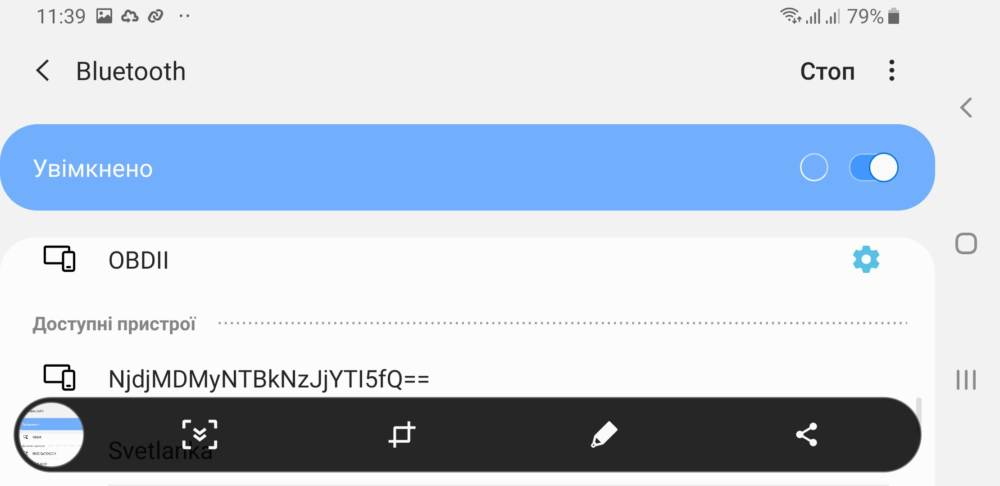

# Side Blennel

Let's check *version* command output:

We see that device supports Wi-Fi/Bluetooth/BLE.
Also task name little bit sound strange (no 'blennel' found in the Webster dictionary). 

Side Blennel... BLEnnel? Side BLE?

Hm. let's check using mobile phone:

Yep, our device is discoverable - we see NNC 0xc06dd4 device that makes me think that it is my Badge - my badge has DeviceID: 1808b9**c06dd4**.

Good, and ... what is it? Description of device is changing! :

Due to description is changing suddenly let's make screenshot and analyze them. 
Below cropped screenshots:

 

Looks like two parts of Base64.
Let's try to decode and check results.

It is very simple - just write seing symbols and... hm, used in device font confusing me in:
* O - 0 (zero) or 'O' (ou) symbol?
* l - lowercase 'L' or uppercase 'I'?

Ok, O (ou) and 0 (zero) can be easily distinguished by width - "zero" thinner, "O" - thicker. Good.
But 'I' and 'l' really looks similar.
One way to solve this is switch mobile theme to use other font to make this symbols look different.

Ok, I don't wish to play with mobile themes. I will try to somehow solve this else.

Let's our code will be:

> ZmxhZ3s4ODYzZDBiZWQ5NzFhNjdjMDMyNTBkNzJjYTI5fQ==

[Base64 decode](https://www.base64decode.org/)r gives result:

> flag{8863d0bed971a67c03250d72ca29}

Let's verify it:

Now we can relax:

# **BUT!!!**

Let's imagine we have the next code:

It seems to be equal to:

> ZmxhZ3tINTkxZjQ5M2M0ZDI2N2E0Y2FIMmNjZjkzYTA3fQ==

and correspondent flag is:

> flag{H591f493c4d267a4caH2ccf93a07} 

But flag is not recognized by badge as valid. Why? It seems to be flag should be in format:
flag{XXX} where XXX are lowercase hex symbols.
But our one contains two non-hex symbols 'H': 

> flag{**H**591f493c4d267a4ca**H**2ccf93a07}

I.e. it seems to be we confuse somewhere I and l.
Let's check our code and mark confusing symbols:

> ZmxhZ3t**I**NTkxZjQ5M2M0ZD**I**2N2E0Y2F**I**MmNjZjkzYTA3fQ==

I.e. 3 symbols.
Totally 2x2x2=8 possible combinations.
Now we may just generate all 8 combinations and corresponding possible flags:

Let's check found flag:

> flag{e591f493c4d267a4cae2ccf93a07}

