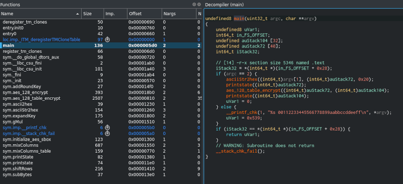
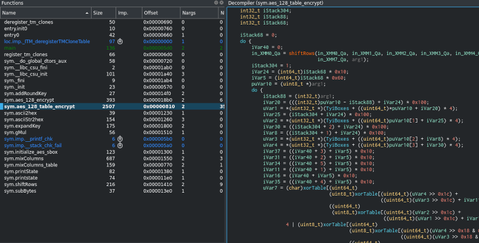
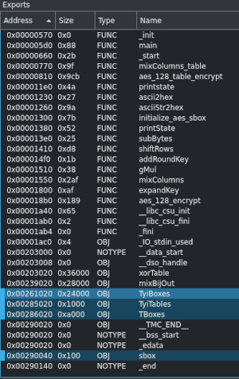
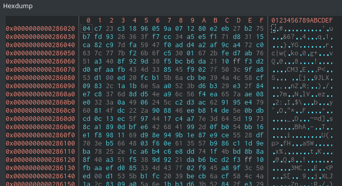
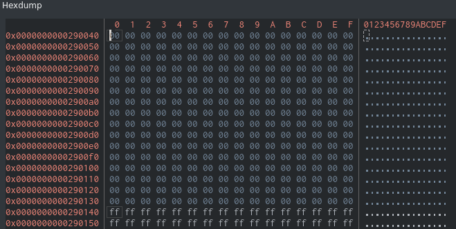
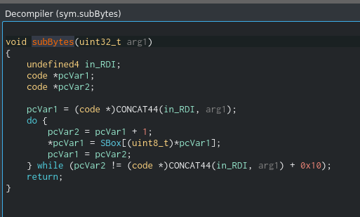
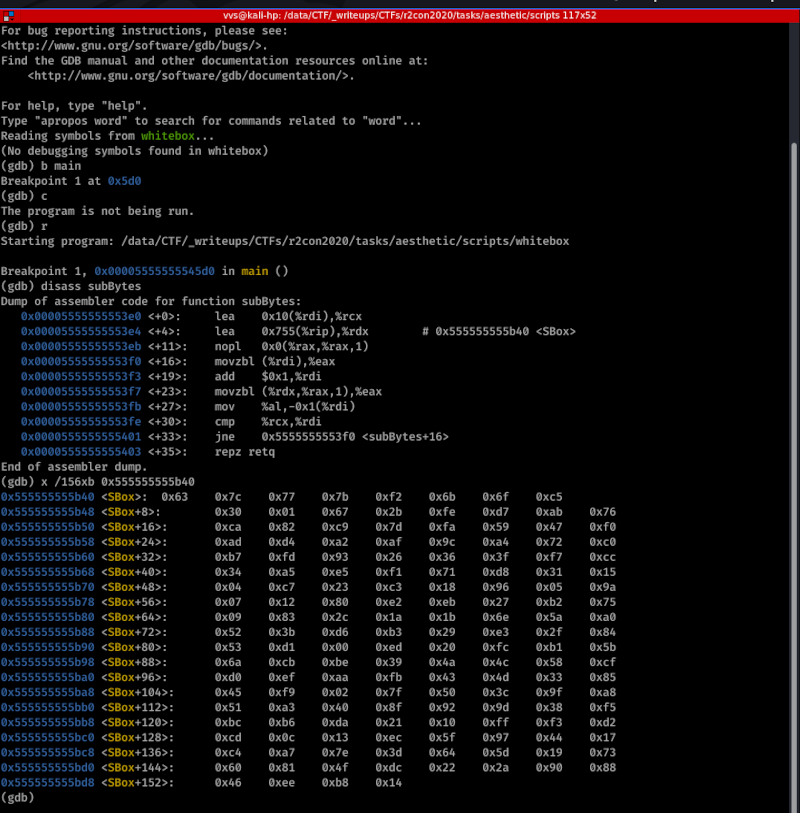

# AESTHETIC

## recon

First open in radare2 or Cutter and check main:



Let's go deeper, to aes_128_table_encrypt .. awful:



Let's check exports...



and google for AES, SBox, TyiBoxes, TyiTables.
Very soon you will get this links:

https://en.wikipedia.org/wiki/Rijndael_S-box

https://github.com/Gr1zz/WhiteBoxAES

Now we know our opponent - WhiteBOX AES %) 


## analisys

Let's check found sources and... we are lucky!!! -> our program is about 100% is https://github.com/Gr1zz/WhiteBoxAES/blob/master/aes_table.c


Checking deeper I found that:

- secret key used generate tables (https://github.com/Gr1zz/WhiteBoxAES/blob/master/genTables.cpp)
- tables after compiled with aes_table.c, original secret key not
- only way to recover secret key is generate it back from tables

### getting Tables

First we need get tables. 

TBoxes is part of binary (offset 0x86020). Good.

SBox - must be standart AES 128 (https://en.wikipedia.org/wiki/Rijndael_S-box) but I prefer to be sure in this %)



It seems to be it is not directly preset in binary (but I was wrong %)



But used in **subBytes** function.



Run in debugger, set breakpoint at main (due to **subBytes** never called) and check memory.

I tried radare2 debug but got warning %) Switching to gdb led to success:



Searching by hex in file I found that table also present in binary at offset 0x1b40.

No need to extract.

### breaking tables

Take closer look to https://github.com/Gr1zz/WhiteBoxAES/blob/master/genTables.cpp , especially to computeTables function.
After stripping all that not related to SBox TBoxes we will get:

```C
void computeTables (u8 expandedKey[176])
{
... 
  // Compute tboxes and compose them at their output with Tyi tables
  for (int i = 0; i < 10; i++)
  {
    shiftRows (expandedKey + 16*i);

    for (int j = 0; j < 16; j++)
    {
...
      for (int x = 0; x < 256; x++)
      {
        u32 tmp = x;
      
        // Input mixing bijection
        if ((i > 0) && (i < 9)) { 
          tmp = vec2int(mb_8x8[i-1][j].invMat * int2vec(x, 8), 8);       
        }
        
        if ((i > 0) && (i < 9))
        {
          tmp = mixBijIn[i-1][j][tmp];
        }
        tmp = SBox[tmp ^ expandedKey[16 * i + j]];
        TBoxes[i][j][x] = tmp;

        if (i == 9)
        {
          TBoxes[i][j][x] ^= expandedKey[160 + j];
        }
        else
        {
          TyiBoxes[i][j][x] = TyiTables[j % 4][tmp];
        }
      }
    } 
  }
```

Still looks awful ? Let's consider only i==0 case:

```C
void computeTables (u8 expandedKey[176])
{
... 
  // Compute tboxes and compose them at their output with Tyi tables
  for (int i = 0; i < 10; i++)
  {
    shiftRows (expandedKey + 16*i);

    for (int j = 0; j < 16; j++)
    {
...
      for (int x = 0; x < 256; x++)
      {
        u32 tmp = x;
...      
        tmp = SBox[tmp ^ expandedKey[16 * i + j]];
        TBoxes[i][j][x] = tmp;
      }
    } 
  }
 ```

Awesome! Why?

```
TBoxes[0][j][x] = Sbox[x^expandedKey[j]]
```
i.e.

```
expandedKey[j]= SboxInv[ TBoxes[0][j][x] ] ^ x
```

Even simpler if take x==0:

```
expandedKey[j]= SboxInv[ TBoxes[0][j][0] ] 
```


## pwn

Let's code:
[script](scripts/solve.py)

PS: in first version of script I forgot abot shiftRows which permutes bytes of initial secret key. 
I.e. to extract secret key from expanded key I had to make reverse permutation (**shiftab_rev** list).
x can be any value from 0 to 255 - result must be the same. If not - something wrong with tables %)


