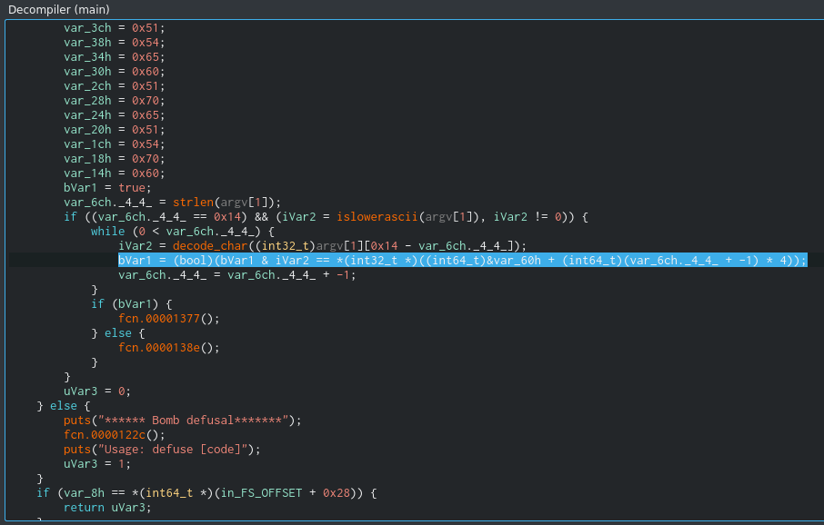

# Defuse

Open in Cutter:


Decompile it:

 

Main points we see are:
- strange 20 numbers
- validation of input string len = must be also 20 (it is pure coincidence? I don't think...)
- together with size validation the other function is called. After I renamed it to islowerascii():


I.e. defuse sequence must be 20 chars string of lower ASCII.

Inside loop we see two things happenn:

- called some function (I renamed it to decode_char() later)


- result if compared with strange 20 numbers



Check decoding function in deep. It is very simple:
```
decoded = ( (input^0x28) + 0x15 ) & 0xf5
```
I wrote 0xf5 due to only last byte validated later.

Very interesting - bitwise AND causes that can be few variants of input which produces the same result.


Check validation:

```
bVar1 = (bool)(bVar1 & iVar2 == *(int32_t *)((int64_t)&var_60h + (int64_t)(var_6ch._4_4_ + -1) * 4));
```

or more compact

```
 decoded[i] == strangekey[20-1+i]
```
 where decoded[i] - decoded by decode_char() i-th input char.
 
 Also important - decoded input chars and strange_numbers copmared in reverse order %)
 
 
 Time to script:
 
```python
#!/usr/bin/env python3
import os,sys
from itertools import *
coded = [ 0x60, 0x70, 0x54, 0x51, 0x65, 0x70, 0x51, 0x60, 0x65, 0x54, 0x51, 0x60, 0x50, 0x54, 0x65, 0x60, 0x71, 0x54, 0x50, 0x60 ]

cand = ""
idx = 1
for i in range(20):
    res=""
    for c in range(97,123):
        if ((c^0x28)+0x15)&0xf5 == coded[i]:
            res+=chr(c)
    print("{:2}: {:4} {}".format(i,res, " ".join( map(lambda c: hex(ord(c)), res ) ) ))
    cand+=res[idx]
    idx ^= 1
print(cand)
```

run

```
 ./solve1.py 
 0: ce   0x63 0x65
 1: su   0x73 0x75
 2: aio  0x61 0x69 0x6f
 3: ln   0x6c 0x6e
 4: prxz 0x70 0x72 0x78 0x7a
 5: su   0x73 0x75
 6: ln   0x6c 0x6e
 7: ce   0x63 0x65
 8: prxz 0x70 0x72 0x78 0x7a
 9: aio  0x61 0x69 0x6f
10: ln   0x6c 0x6e
11: ce   0x63 0x65
12: km   0x6b 0x6d
13: aio  0x61 0x69 0x6f
14: prxz 0x70 0x72 0x78 0x7a
15: ce   0x63 0x65
16: tv   0x74 0x76
17: aio  0x61 0x69 0x6f
18: km   0x6b 0x6d
19: ce   0x63 0x65
The first good candidate is: esilrsncrancmarcvamc
Amount of variants is: 42467328
```

take the first good sequence and ... success???? :


Trying found sequence as a flag and... fault!

What to do?

To check all 42467328 flags is unreal.
After checking task hint and looking to results above we can reduce varinats on 2x2x3x2 (flag started with "esil") but 1 769 472 variants are too much tooo...

Will try reduce variants:

All variants, worst way:

```python
#!/usr/bin/env python3
import os,sys
from itertools import *

for p in product( 'prxz', 'su', 'ln', 'ce', 'prxz', 'aio', 'ln', 'ce', 'km', 'aio', 'prxz', 'ce', 'tv', 'aio', 'km', 'ce' ):
    print("esil"+"".join(p))
```

But lets try found readble words inside.
Try prefix:

```python
#!/usr/bin/env python3
import os,sys
from itertools import *

for p in product( 'prxz', 'su', 'ln', 'ce', 'prxz', 'aio' ):
    print("esil"+"".join(p))
```

It seems only 'rule' good.

Try last 6:
```python
#!/usr/bin/env python3
import os,sys
from itertools import *
for p in product( 'prxz', 'ce', 'tv', 'aio', 'km', 'ce' ):
    print("esil"+"".join(p))
```

The best candidates are:

['take','time','tome']

```python
#!/usr/bin/env python3
import os,sys
from itertools import *
for p in product( ['rule'], , 'prxz', 'aio', 'ln', 'ce', 'km', 'aio', 'prxz', 'ce', ['take','time','tome']):
    print("esil"+"".join(p))
```

'tome' it seems to be wrong way, let's check only 'time':

```python
#!/usr/bin/env python3
import os,sys
from itertools import *
for p in product( ['rule'], 'prxz', 'aio', 'ln', 'ce', 'km', 'aio', 'prxz', 'ce', ['time']):
    print("esil"+"".join(p))
```

Checking output I mentioned very interesting 'more'. "More time"? Why not...

```python
#!/usr/bin/env python3
import os,sys
from itertools import *
for p in product( ['rule'], 'prxz', 'aio', 'ln', 'ce', ['more'], ['time']):
    print("esil"+"".join(p))
```

Just 48 variants - correct flag among them ^)
(I checked - it is true!)


