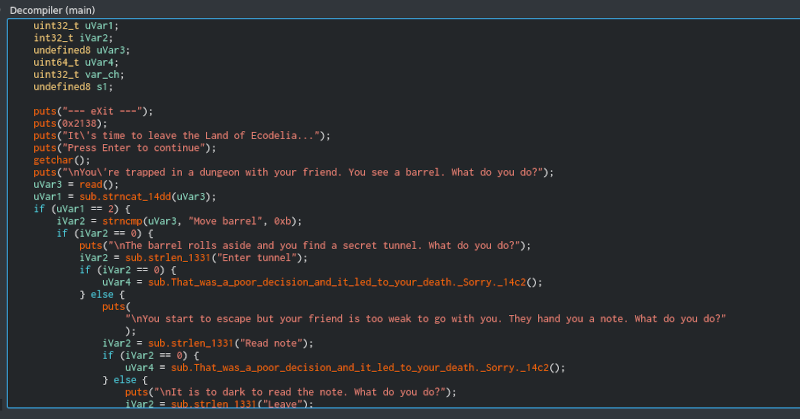
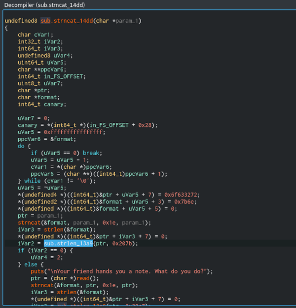
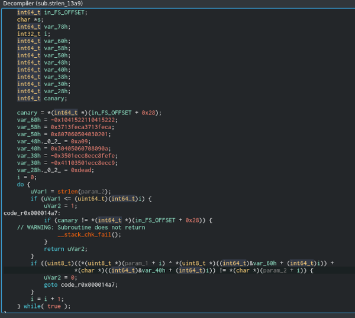

# eXit

## recon

I used both Cutter (for static analisys, on one display) and radare2 as debugger (to gather dynamic data, on second display).

First open in Cutter and decompiler:



First look gives obvious way:

- Move barrel
- Enter tunnel
- Read note
- Leave

but it is wrong way.

Investigating deeper I mentioned "strncat_14dd", which inside looks not like strncat %) :



Inside such pseudo-strncat I found strange pseudo-strlen (strlen_13a9)



Due to I'me too lazy to decode all stuff I switched to debugger

## debug time

Start debug session:


Locate pseudo-strncat:


Go inside pseudo-strncat:


Locate psedo-strlen:


Go inside pseudo-strlen and check passed arguments:


Remeber that arguments passed via registers in order ( https://en.wikipedia.org/wiki/X86_calling_conventions ):
RDI, RSI, RDX, RCX, R8, R9

rdi => Input string
rsi => some_secret_key

Below in the 

```C
        if ((uint8_t)((*(uint8_t *)(param_1 + i) ^ *(uint8_t *)((int64_t)&var_60h + (int64_t)i)) +
                     *(char *)((int64_t)&var_40h + (int64_t)i)) != *(char *)(param_2 + i)) {
            uVar2 = 0;
            goto code_r0x000014a7;
        }
```
where:
- param_1=some_secret_key, 
- param_2=input text
- var_40 and var_60 - also some secret keys. Debugging and dumping memory I found that they are same for each check, only param_1 changed i.e. param_1 is coded answer, which can be decoded using var_40 and var_60


var_40 and var_60 I dumped from memory (sure I could decode them from set of *mov* operations at the beginning of pseudo-strlen but I'm too lazy, remember?)

I named them as d1 and d2 in the script.

Reversing C-code above I got final script:

```python
#!/usr/bin/env python3

import os, sys

d1=bytearray.fromhex("deadbeefdeadbeefcafe1337cafe13370102030405060708090a")
d2=bytearray.fromhex("0a09080706050403020137133713feca37133713fecaefbeadde")

def decode(rx):
    r=bytearray.fromhex(rx)
    res=""
    for i in range(len(r)):
        v = ( r[i] - d2[i])
        v = (v+0x100)%0x100
        #print("{:02x} - {:02x} = {:02x}".format(r[i], d2[i], v))
        v ^= d1[i]
        v = (v+0x100)%0x100
        #print("v ^ {:02x} = {:02x}".format(d1[i], v))
        res+=chr(v)
    print(res)


decode("97cdd2d6c0c7cd84ec91ad62f5f165225882b137613e5d2b144c")
decode("9ccde18eb092d791c09eb2")
decode("97e2e79d")
```

Last two *secret_code_key* strings were received just entering correct answer and catching param_1 on the next answer.

