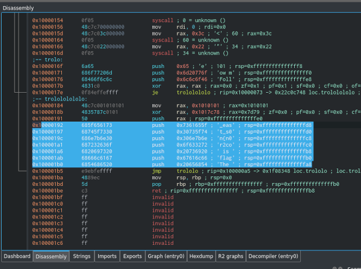
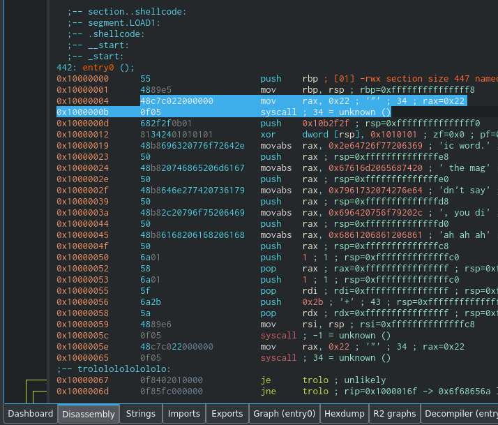
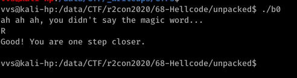

# Hellcode

Open in Cutter, decompile and... yes I found flag:



The flag is r2con{n0t_s0_easy} ... and not accepted...

Ok, try debug.. but odd *syscall 0x22* broke game:



https://filippo.io/linux-syscall-table/
```
34	pause	sys_pause	kernel/signal.c
```

Ok, nopping all these *syscall 0x22*:

```
radiff2 binary0 binary0_patched 
0x00001004 48c7c0220000000f05 => 909090909090909090 0x00001004
0x0000105e 48c7c0220000000f05 => 909090909090909090 0x0000105e
0x00001073 48c7c0220000000f05 => 909090909090909090 0x00001073
0x0000108c 48c7c0220000000f05 => 909090909090909090 0x0000108c
0x000010b1 48c7c0220000000f05 => 909090909090909090 0x000010b1
0x000010bd 48c7c0220000000f05 => 909090909090909090 0x000010bd
0x000010cb 48c7c0220000000f05 => 909090909090909090 0x000010cb
0x00001166 48c7c0220000000f05 => 909090909090909090 0x00001166
```
(I patched directly in ... midnight commander - some habits are difficult to change).

Reopen patched binary and found this (or run debugger and trace until you see where input validated):


```
0x100000ba      80ea53                 sub     dl, 0x53 ; 83 ; dl=0xffffffffffffffad ; of=0x0 ; sf=0x1 ; zf=0x0 ; pf=0x0 ; cf=0x1
0x100000bd      90                     nop
0x100000be      90                     nop
0x100000bf      90                     nop
0x100000c0      90                     nop
0x100000c1      90                     nop
0x100000c2      90                     nop
0x100000c3      90                     nop
0x100000c4      90                     nop
0x100000c5      90                     nop
0x100000c6      4831c9                 xor     rcx, rcx ; rcx=0x0 ; zf=0x1 ; pf=0x1 ; sf=0x0 ; cf=0x0 ; of=0x0
0x100000c9      759c                   jne     trolololololololo ; unlikely
0x100000cb      90                     nop
0x100000cc      90                     nop
0x100000cd      90                     nop
0x100000ce      90                     nop
0x100000cf      90                     nop
0x100000d0      90                     nop
0x100000d1      90                     nop
0x100000d2      90                     nop
0x100000d3      90                     nop
0x100000d4      80faff                 cmp     dl, 0xff ; 255 ; zf=0x0 ; cf=0x1 ; pf=0x0 ; sf=0x1 ; of=0x0
0x100000d7      7558                   jne     error ; rip=0x10000131 -> 0x20646268 loc.error ; likely
```

I.e.
```
input-=0x53
if(input==0xff) SUCCESS
```
To get desired input just do reverse (don't forget about overflow!):
```
input = (0x53+0xff) % 256 = 0x52
```
or 'R'

Checking:



Next we have two choices - manually re-do for each binary or... Sure **OR** - time for scripting:

```python
#!/usr/bin/env python3

import os, sys

base ="binary"

text = ""
for i in range(111):
    fname = "{}{}".format(base, i)
    with open(fname, "rb") as f:
        buf = f.read()
        a, b = buf[0x10bc], buf[0x10d6]
        if buf[0x10ba]==0x80 and buf[0x10bb]==0xea: #sub
            c = a+b
        else:
            assert(0)
        print("{:3}: {:02x} {:02x} = {:02x} {} ".format(i,a,b,c%256,chr(c%256)))
        text+=chr(c%256)
print(text)
```

I added **assert** to catch *different* binaries i.e. I suspected that game is not over %)
Getting assert I rechecked *different* binary and found other validation algorithm, added it to script and so on.

Final script is:

```python
#!/usr/bin/env python3

import os, sys

base ="binary"

text = ""
for i in range(111):
    fname = "{}{}".format(base, i)
    with open(fname, "rb") as f:
        buf = f.read()
        a, b = buf[0x10bc], buf[0x10d6]
        if buf[0x10ba]==0x80 and buf[0x10bb]==0xea: #sub
            c = a+b
        elif buf[0x10ba]==0x80 and buf[0x10bb]==0xf2: #xor
            c = a^b
        elif buf[0x10ba]==0x80 and buf[0x10bb]==0xc2: #add 
            c = b-a
        else:
            assert(0)
        print("{:3}: {:02x} {:02x} = {:02x} {} ".format(i,a,b,c%256,chr(c%256)))
        text+=chr(c%256)

print(text)
```
