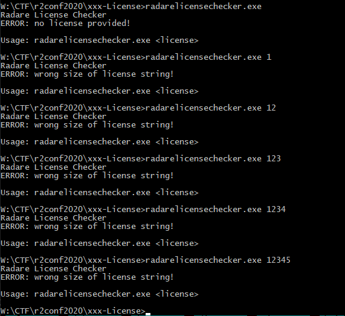
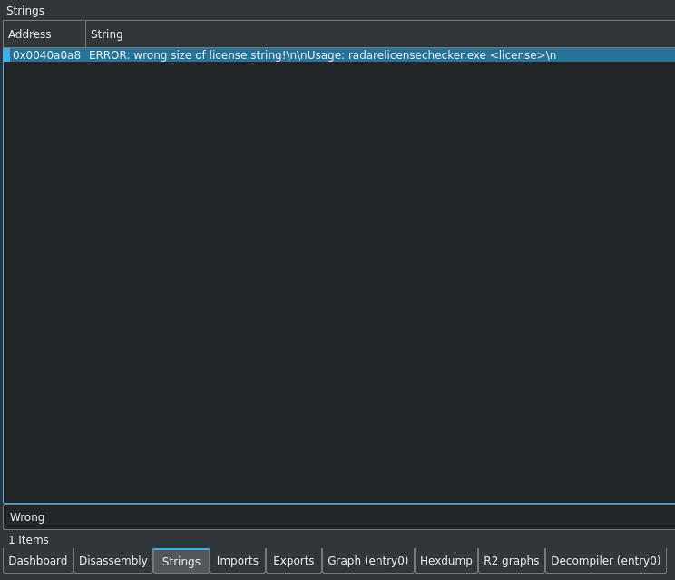
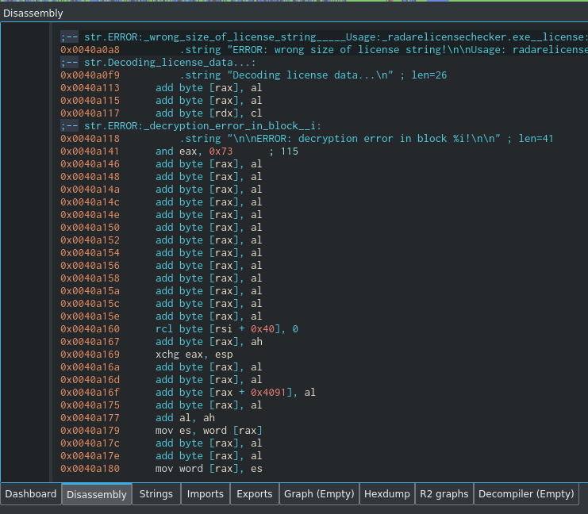
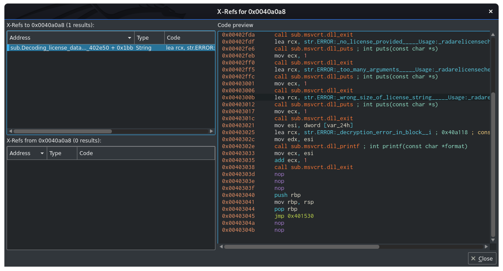
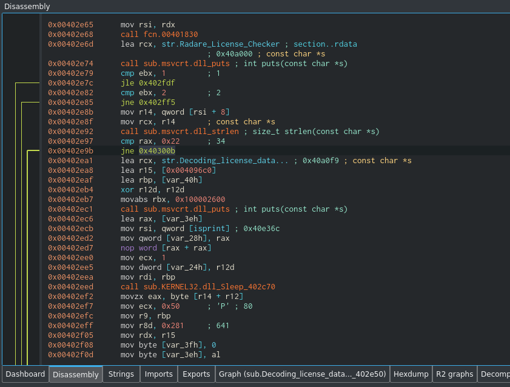
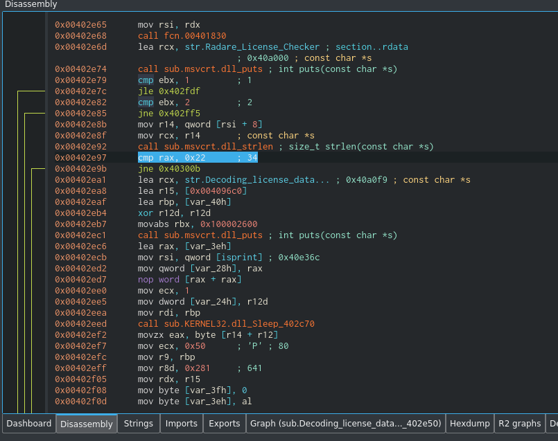
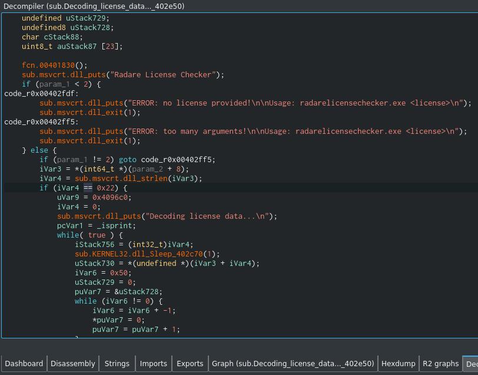
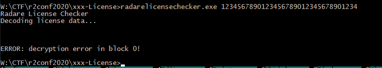
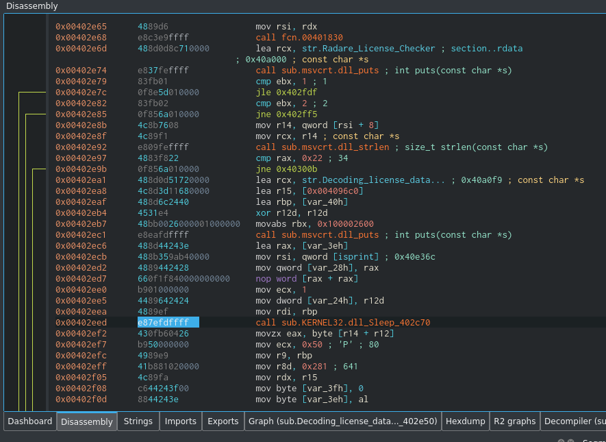
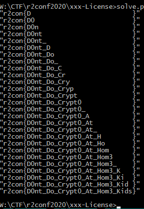

# Radare License Checker

## First run



We need to know correct size first.

Open binary in Cutter to check.

## Get correct size

Locate incorrect size warning in the Strings:



Go to the needed string:

 

Locate X-Ref to it:

 

Go back to conditional jump (strlen is hint):



Correct size is 0x22 :



The same by decompiling:



## Second run

Try run with any 34-bytes key:



Ok. Even more - we saw how much correct numbers at the start of tested key (zero in last case %)

## time to script

But first remember a delay during program run. It seems to be brute-force protection in it.

Remove it - it was very easy found by **sleep** call:



I just NOP-ed it.

Script:

### 
```python
#!/usr/bin/env python

import os, sys
from py_execute.process_executor import execute
from mock import Mock

cmd = "radarelicensechecker_patched.exe "
key_pre = "r2con{"
key_sfx = "}"
key_mid = [' '] * (34 - len(key_pre) - len(key_sfx))

i=0
while i<len(key_mid):
    key = "\""+key_pre + "".join(key_mid) + key_sfx + "\""
    ret = execute(cmd+key, ui=Mock())
    msg = "ERROR: decryption error in block "
    if  msg not in ret[1]:
        print(key)
        break
    pos1 = ret[1].find(msg) + len(msg)
    pos2 = ret[1].find("!", pos1)
    blk = int( ret[1][pos1:pos2].strip())
    if blk == i+len(key_pre):
        key_mid[i] = chr( ord(key_mid[i]) + 1)
        if key_mid[i]=="\"":
            key_mid[i] = chr( ord(key_mid[i]) + 1)
    else:
        i+=1
        print(key)
        continue
```

Voila :


